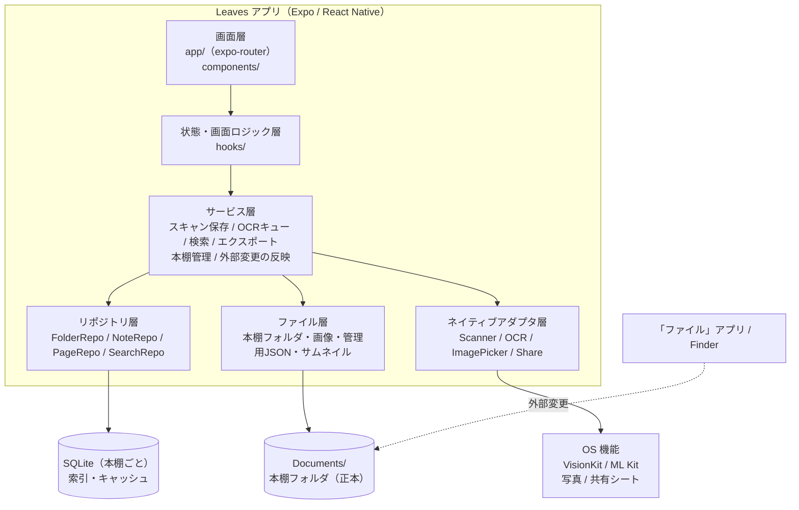
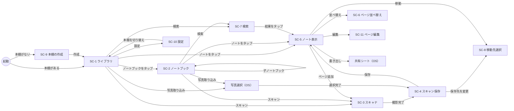
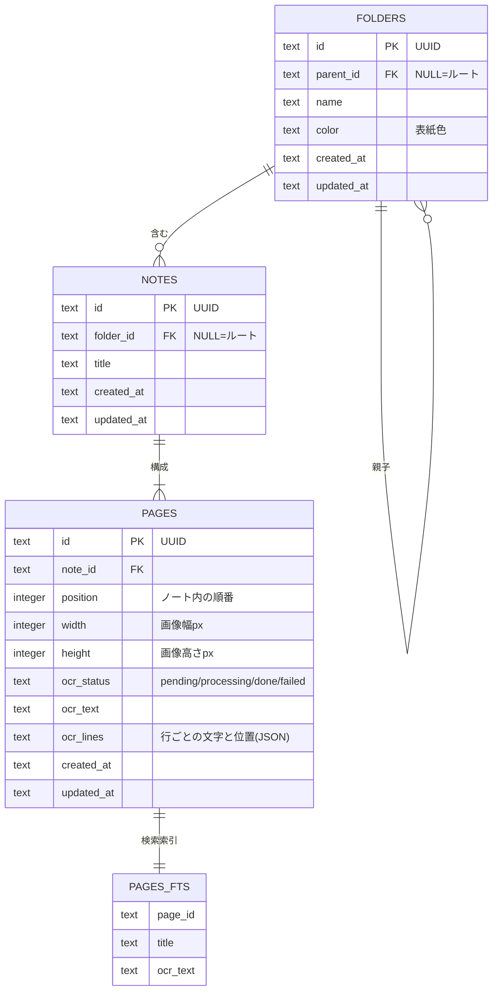
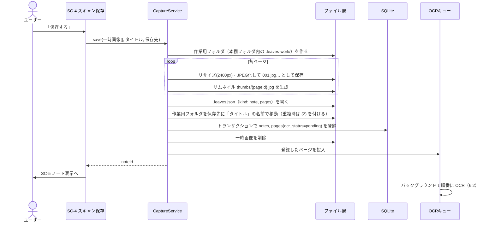
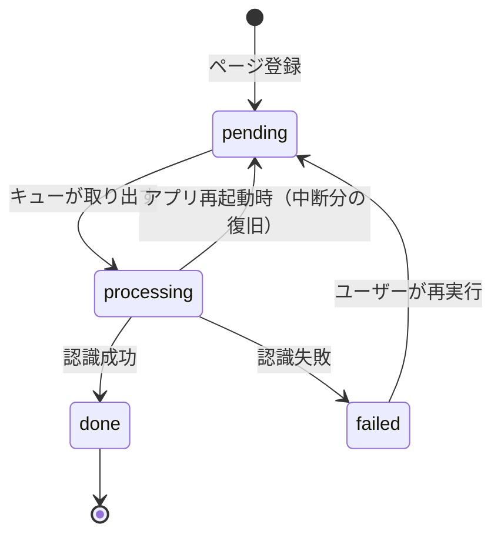
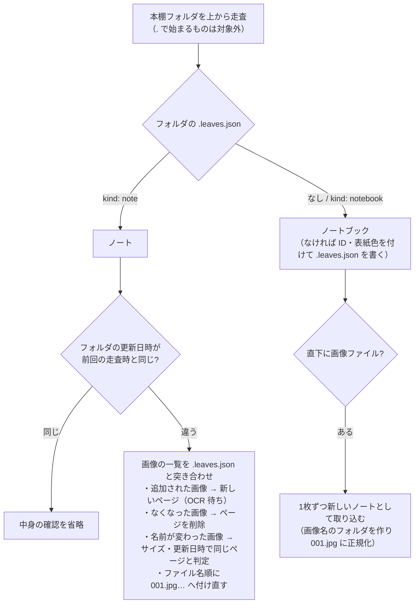
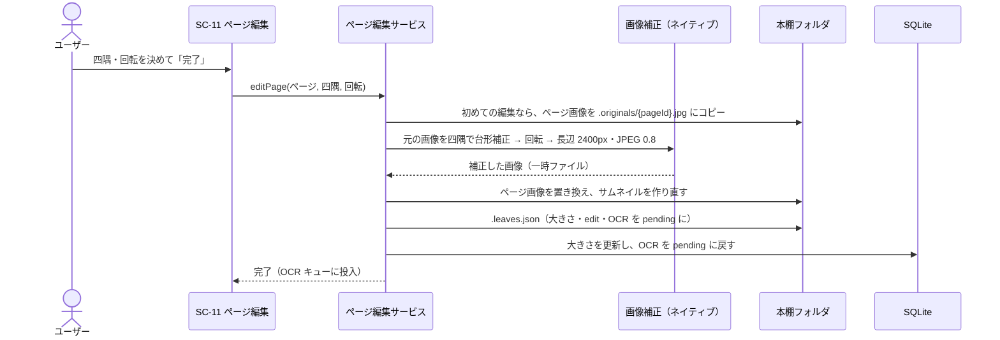

# Leaves 基本設計書

| 項目 | 内容 |
|---|---|
| 文書名 | Leaves 基本設計書 |
| 版数 | 1.6 |
| 作成日 | 2026-09-28 |
| 作成者 | SasaBranch |
| ステータス | 確定 |
| 入力文書 | [要件定義書 v1.5](../01_requirements/requirements.md) |

### 改訂履歴

| 版数 | 日付 | 内容 |
|---|---|---|
| 0.1 | 2026-09-28 | 初版作成 |
| 1.0 | 2026-09-28 | レビュー完了、確定 |
| 1.1 | 2026-09-28 | 要件定義書 v1.2（本棚・ファイルとしての保存・外部変更の反映）に対応。1.2〜1.3, 3.1, 4.1〜4.3（SC-9, SC-10 追加）, 5章, 6.1, 6.3, 6.5, 6.7〜6.10, 7〜11章。ADR 0016〜0018 |
| 1.6 | 2026-09-29 | 4.1・4.3 SC-10 の「保存場所の案内」をやめ、各本棚の行に場所（入っているフォルダまで）を出す（利用者との確認による） |
| 1.5 | 2026-09-28 | 要件定義書 v1.5（本棚の保存場所）に対応。4.3（SC-9, SC-10）、5.4、6.1、6.5、6.7、6.8、6.12、7、10、11章 |
| 1.4 | 2026-09-28 | 2.5 アプリアイコンを追加 |
| 1.3 | 2026-09-28 | 6.7・7章 開いている本棚が外部で名前変更・削除された場合の扱いを追加（利用者との確認による） |
| 1.2 | 2026-09-28 | 要件定義書 v1.3（保存後のページの編集）に対応。4.1〜4.3（SC-11 追加）, 5.4, 5.6, 6.11, 7, 10, 11章 |

---

## 1. はじめに

### 1.1 本書の目的
要件定義書で定めた機能要件・非機能要件を実現するための、システム構成・画面・データ・処理の **外部から見た設計** を定める。クラス・関数・SQL などの内部設計は詳細設計書で扱う。

### 1.2 要件定義書の未決事項の決定

| No | 未決事項 | 決定内容 |
|---|---|---|
| Q-1 | 最低対応OS | **iOS 16.4 以上 / Android 10（API 29）以上**。Expo SDK 57 の iOS 最低要件（16.4）に合わせる |
| Q-2 | 保存画像の解像度・圧縮率 | **長辺 2400px・JPEG 品質 0.8**（1ページ約 0.5〜1MB）。一覧用サムネイルは別途 長辺 480px を生成 |
| Q-3 | PDF への OCR テキスト埋め込み | **埋め込む**。OCR の行位置に透明テキストを重ね、PDF 内検索・コピーを可能にする |
| Q-4 | 取り込み画像の輪郭補正 | **補正しない**（両OSでそのまま保存）。補正は将来の画像編集機能で扱う |
| Q-5〜7 | 本棚の呼び名・データの持ち方・外部変更への対応範囲 | 要件定義書 v1.2 で決定済み。**本棚のフォルダの中身を正（正本）とし、DB はその索引・キャッシュとする**（5章、ADR 0016） |

### 1.3 UI上の呼称
内部データとしては「フォルダ」だが、**UI上は「ノートブック」と表示する**。フォルダ階層を意識させず、ノート・冊子を並べた本棚として見せるため（2章のデザイン方針）。

| 内部（本書・コード） | UI表示 |
|---|---|
| 本棚（shelf） | 本棚 |
| フォルダ（folder） | ノートブック |
| ルート | ライブラリ（見出しには本棚の名前を表示する） |
| ノート（note） | ノート |
| ページ（page） | ページ |

---

## 2. デザイン方針

デザインモックは Claude Design で作成済み（5画面 × ダーク/ライト）。本章はそのモックを仕様として固定する。

### 2.1 コンセプト
- **本棚のように見せる**: フォルダはアイコンではなく「色付き表紙＋紙が重なった冊子」、ノートは「1ページ目のサムネイル＝紙の表紙」として並べる
- **階層を主張しない**: ツリー表示・パンくず帯は置かず、戻るボタンに親の名前を表示する程度に留める
- **スキャンまでの距離を最短に**: 一覧系画面の下部に常にフローティングアクションバー（写真取り込み＋スキャン）を置く
- **紙は紙のまま**: ダークモードでもノートのサムネイル・ページは紙色で表示する

### 2.2 カラートークン
テーマは **OS の設定（ライト/ダーク）に追従** する。アプリ内の切り替えは設けない。

| トークン | 用途 | ダーク | ライト |
|---|---|---|---|
| `bg` | 画面背景 | `#0E1310` | `#F6F7F3` |
| `stage` | ノート表示画面の背景 | `#0A0E0B` | `#E9ECE7` |
| `surface` | カード・シート | `#161D18` | `#FFFFFF` |
| `surface2` | 入力欄・二次ボタン | `#1D2620` | `#EBEFE9` |
| `border` | 区切り線・枠 | `#29342C` | `#DFE5DD` |
| `text` | 本文 | `#E7ECE8` | `#17201A` |
| `muted` | 補足テキスト | `#97A49B` | `#5B685F` |
| `accent` | 主ボタン・選択状態 | `#5FD08E` | `#1E7F48` |
| `onAccent` | accent 上の文字 | `#08240F` | `#FFFFFF` |
| `accentText` | リンク・強調文字 | `#7EDDA5` | `#1E7F48` |
| `accentSoft` | 検索ハイライト・状態チップ背景 | `rgba(95,208,142,0.16)` | `#DDF0E4` |
| `paper` | 紙（サムネイル・ページ背景） | `#F3F0E6` | `#FFFEFA` |

ノートブックの表紙色は次の6色から選択（作成時に自動で順番に割り当て、変更可能）:
`#2F5D45`（モス） / `#2D5461`（ティール） / `#6A4E38`（ブラウン） / `#4B7A5F`（リーフ） / `#3C4A5E`（スレート） / `#7A3E3E`（ワイン）

### 2.3 タイポグラフィ

| 用途 | フォント | 備考 |
|---|---|---|
| ロゴ・大きな数字 | Fraunces（600） | 「Leaves」ワードマーク |
| UI全般 | Zen Kaku Gothic New（400/500/700） | 見出し 26px / 本文 15px / 補足 11〜13px |

※ モックの手書き表現（Klee One）はダミーデータ用であり、実アプリではスキャン画像そのものが表示される。

### 2.4 共通コンポーネント

| コンポーネント | 仕様 |
|---|---|
| ノート表紙（NoteCover） | 1ページ目のサムネイルを 3:4 で表示、角丸 5px、影付き。右下にページ数バッジ（例: `5p`）。下にタイトル（1行省略）と日付 |
| ノートブック表紙（NotebookCover） | 表紙色の 3:4 カード。左に背表紙（暗い帯）、上部に白いラベルに名前、背後に紙が2枚重なった表現。下に名前と「N ノート」（子孫のノートブックの分も含めた総数。#37） |
| フローティングアクションバー | 画面下中央のカプセル。左: 写真取り込み（円形・二次色）、右: 「スキャン」（accent 色の大ボタン） |
| ボトムシート | ノート表示画面の文字認識テキスト・操作ボタンを格納。角丸 22px、ドラッグで展開 |
| アイコン | lucide（線アイコン、線幅 1.8〜2） |

タップ領域は最小 44×44pt を確保する。

### 2.5 アプリアイコン
白地に、平面の面を組み合わせた緑の二枚葉（Obsidian のロゴの「多面体の宝石」の考え方を、白地・緑・葉に置き換えたもの）。光の当たる左上を明るく、右下を暗くして立体感を出す。二枚葉で「Leaves（複数形）」を表す。

- 形の正本は `scripts/generate-icons.py` の多角形の座標。画像（iOS のライト・ダーク・色付き、Android のアダプティブアイコン、起動画面）はこのスクリプトで作る
- Android のアダプティブアイコンは、端末ごとの切り抜きで欠けないよう、葉を中央の安全な範囲（直径の約 66%）に収める

---

## 3. システム構成

### 3.1 全体構成
外部サーバーを持たない **端末内完結型** のアプリ。データは端末のアプリの書類領域（Documents）に **本棚ごとのフォルダ** として保存し、「ファイル」アプリ・Finder からも見えるようにする（FR-X-02）。

**本棚のフォルダの中身（フォルダ・画像・管理用の小さな JSON）が正本** であり、SQLite は一覧・検索を速くするための索引とキャッシュである。DB は失われても本棚フォルダから作り直せる（NFR-R-05、ADR 0016）。



| 層 | 責務 | 依存してよい層 |
|---|---|---|
| 画面層 | 表示とユーザー操作の受け付け | 状態・画面ロジック層 |
| 状態・画面ロジック層 | 画面に必要なデータの取得・更新通知の購読 | サービス層、リポジトリ層（参照のみ） |
| サービス層 | 複数のリポジトリ・ファイル・ネイティブ機能をまたぐ業務処理 | リポジトリ層、ファイル層、ネイティブアダプタ層 |
| リポジトリ層 | SQLite への読み書き（1テーブル群＝1リポジトリ） | なし（DB のみ） |
| ファイル層 | 画像の保存・削除・パス解決 | なし（ファイルシステムのみ） |
| ネイティブアダプタ層 | 外部ライブラリの呼び出しを包む（差し替え・テスト用のモックを可能にする） | なし（ライブラリのみ） |

### 3.2 技術スタック

| 分類 | 採用 | 用途 |
|---|---|---|
| フレームワーク | Expo SDK 57 / React Native / TypeScript（strict） | アプリ基盤 |
| 画面遷移 | expo-router | ファイルベースルーティング |
| データベース | expo-sqlite | メタデータ保存、FTS5 全文検索 |
| ファイル | expo-file-system | 画像の保存・削除 |
| 画像処理 | expo-image-manipulator | リサイズ・JPEG 圧縮・サムネイル生成 |
| 画像表示 | expo-image | サムネイルのキャッシュ付き表示 |
| スキャン | react-native-document-scanner-plugin | iOS: VisionKit / Android: ML Kit Document Scanner |
| OCR | @react-native-ml-kit/text-recognition | 日本語認識（両OS） |
| 写真取り込み | expo-image-picker | 複数選択 |
| 一覧表示 | @shopify/flash-list | 大量件数でも高速なリスト・グリッド |
| ジェスチャー | react-native-gesture-handler / react-native-reanimated | ピンチズーム、ページ並べ替え、ボトムシート |
| PDF 生成 | pdf-lib + @pdf-lib/fontkit | 画像＋透明テキストの PDF 生成 |
| PDF 用フォント | Noto Sans JP（アプリに同梱） | 透明テキストの日本語グリフ（サブセット埋め込み） |
| zip 生成 | jszip | Markdown エクスポート |
| 共有 | expo-sharing | OS 共有シート |
| アイコン | lucide-react-native | 線アイコン |
| テスト | Jest（jest-expo） | 単体テスト |

※ 各ライブラリの具体的なバージョンは実装開始時に固定し、詳細設計書に記載する。

### 3.3 実行環境・ビルド

| 項目 | 内容 |
|---|---|
| 対応OS | iOS 16.4 以上 / Android 10（API 29）以上 |
| ビルド | 開発ビルド（`npx expo run:ios` / `npx expo run:android`）。EAS などの有料サービスは使わない |
| 動作確認 | 画面・データ系: シミュレータ/エミュレータ、スキャン: 実機 |
| 通信 | 行わない（ネットワーク権限を使う機能・SDK を含めない） |

---

## 4. 画面設計

### 4.1 画面一覧

| ID | 画面名 | ルート | 表示形式 | 関連要件 |
|---|---|---|---|---|
| SC-1 | ライブラリ | `/` | 通常 | FR-F-01,07〜08, FR-N-09 |
| SC-2 | ノートブック | `/folder/[id]` | 通常 | FR-F-01〜09, FR-N-09 |
| SC-3 | スキャナ | （OS 標準 UI） | 全画面 | FR-S-01〜04 |
| SC-4 | スキャン保存 | `/capture` | モーダル | FR-S-05〜07 |
| SC-5 | ノート表示 | `/note/[id]` | 通常 | FR-N-01〜08, FR-O-05〜06, FR-E-01〜04 |
| SC-6 | ページ並べ替え | `/note/[id]/reorder` | モーダル | FR-N-07〜08 |
| SC-7 | 検索 | `/search` | モーダル | FR-Q-01〜05 |
| SC-8 | 移動先選択 | `/move` | モーダル | FR-F-04, FR-N-04, FR-S-06 |
| SC-9 | 本棚の作成（初回） | `/welcome` | 全画面（戻れない） | FR-V-01 |
| SC-10 | 設定 | `/settings` | モーダル | FR-V-02〜06 |
| SC-11 | ページ編集 | `/note/[id]/edit` | モーダル | FR-N-10〜13 |

SC-1 と SC-2 は同じ画面部品を使い、ルート（フォルダ ID なし）かどうかでヘッダーのみ切り替える。
設定画面（SC-10）の項目は本棚の管理（各本棚の場所を含む）と、アプリの情報だけとする（テーマは OS 追従、画質は固定のため）。

### 4.2 画面遷移



### 4.3 各画面の仕様

#### SC-1 ライブラリ / SC-2 ノートブック

| 領域 | SC-1 ライブラリ | SC-2 ノートブック |
|---|---|---|
| ヘッダー左 | 「Leaves」ロゴ | 戻る（親の名前を表示） |
| ヘッダー右 | 新しいノートブック、設定（SC-10） | 検索（この中を検索）、その他メニュー |
| 見出し | 検索バー（タップで SC-7） | 表紙＋名前＋「N ノート · N ページ · 更新日」（子孫のノートブックの分も含めた総数） |
| 上段 | 最近のノート（更新日時順 最大10件、横スクロール）。その下の一覧の見出しは **開いている本棚の名前**（FR-V-08） | 子ノートブック（チップ形式、横スクロール）＋追加ボタン |
| 本体 | ノートブック（3列グリッド）→ ノート（3列グリッド） | ノート（2列グリッド）。グリッド/リスト表示切り替え |
| 並び順 | 更新順 / 名前順（ノートブックが常に先） | 同左 |
| 下部 | フローティングアクションバー | 同左 |

- **長押しメニュー**（ノートブック）: 名前を変更 / 表紙の色 / 移動 / 削除
- **長押しメニュー**（ノート）: 名前を変更 / 移動 / 書き出し / 削除
- **その他メニュー**: 新しいノートブック / 並び順
- ノートブック削除時は「中のノートブック N 件・ノート N 件もすべて削除されます」と件数を表示して確認する（FR-F-05）
- 空の状態: 「右下のスキャンから最初のノートを作りましょう」と案内を表示

#### SC-3 スキャナ
OS 標準スキャナ UI をそのまま使う（輪郭検出・台形補正・四隅調整・複数ページ・撮り直しは OS 側の機能）。キャンセル時は元の画面に戻り、何も保存しない。

#### SC-4 スキャン保存

| 領域 | 内容 |
|---|---|
| ヘッダー | 閉じる（破棄確認あり）、「スキャン完了」 |
| 件数 | 「N ページを取り込みました」 |
| ページ一覧 | 横スクロールのサムネイル（番号付き）。長押しドラッグで並べ替え、×で除外。末尾に「追加で撮影」 |
| タイトル | 初期値 `YYYY-MM-DD HH.mm`（FR-S-07。`:` はファイル名に使えないため）。タップで編集。保存先に同じ名前があれば保存時に ` (2)` などを付ける |
| 保存先 | 開いていたノートブック（FR-S-06）。タップで SC-8 |
| 注記 | 「保存後、端末内で文字認識を行います（通信なし）」 |
| 主ボタン | 「保存する」→ 保存処理（6.1）→ SC-5 へ置き換え遷移 |

既存ノートへのページ追加（FR-N-06）の場合は、タイトル・保存先を表示せず、ボタンを「N ページを追加」とする。

#### SC-5 ノート表示

| 領域 | 内容 |
|---|---|
| ヘッダー | 戻る、タイトル（タップで名前変更）、所属パス・更新日時、共有（書き出しメニュー） |
| ページ | 紙画像を画面幅いっぱいに表示。左右スワイプでページ移動、ピンチで拡大（FR-N-01〜02） |
| ページ帯 | 小サムネイル列（現在ページを accent 枠）＋「2 / 5」 |
| ボトムシート（折りたたみ） | 文字認識テキスト（2行）、状態チップ、コピー |
| ボトムシート（展開） | 全文表示・テキスト選択可。失敗時は「再実行」ボタン（FR-O-05） |
| 操作 | ページ追加 / 編集（表示中のページ。SC-11） / 並べ替え / 書き出し / 移動 / 削除 |
| 書き出しメニュー | PDF で書き出し / Markdown で書き出し / このページの画像を共有 |

OCR 状態チップの表示:

| 状態 | 表示 |
|---|---|
| pending | 「認識待ち」（muted） |
| processing | 「認識中…」（スピナー） |
| done | 「認識済み」（accentSoft） |
| failed | 「認識できませんでした」＋ 再実行 |

#### SC-6 ページ並べ替え
2列グリッドでページを表示。長押しドラッグで並べ替え、各ページの削除ボタン。「完了」で確定。最後の1ページを削除しようとした場合は「ノートごと削除しますか？」と確認する（FR-N-08）。

#### SC-7 検索

| 領域 | 内容 |
|---|---|
| 検索欄 | 自動フォーカス。入力後 300ms で検索（デバウンス） |
| 範囲チップ | 「すべて」＋ルート直下のノートブック。SC-2 から開いた場合はそのノートブックを初期選択（FR-Q-05） |
| 件数 | 「「キーワード」を含むページ N 件」 |
| 結果行 | サムネイル、ノート名、ページ番号、所属パス、一致箇所の前後テキスト（一致部分を accentSoft で強調） |
| タップ | SC-5 を該当ページを開いた状態で表示（FR-Q-04） |

結果は **ページ単位** で表示する（同じノートの複数ページが一致すれば複数行）。タイトルのみ一致したノートは1ページ目を結果として表示する。

#### SC-8 移動先選択
ライブラリをルートとしたノートブックのツリーを表示し、1つを選択する。フォルダ移動時は、移動対象自身とその子孫を選択不可（グレー表示）にする（FR-F-04）。「新しいノートブック」をここからも作成できる。
対象は開いている本棚の中だけ（FR-V-07）。

#### SC-9 本棚の作成（初回）
本棚が1つもないときだけ表示する全画面。戻る操作はない。

| 領域 | 内容 |
|---|---|
| 上部 | 「Leaves」ロゴ、説明「紙のノートをしまう本棚を作りましょう」 |
| 入力欄 | 本棚の名前（初期値「マイ本棚」、自動フォーカス） |
| 保存場所 | 「アプリ内（このiPhone内 > Leaves）」（初期値）/「別の場所を選ぶ…」（OS のフォルダ選択画面。選んだフォルダの中に本棚のフォルダを作る。FR-L-01）。選んだ場所を表示する |
| 注記 | 選んだ場所に応じて「本棚は「ファイル」アプリの このiPhone内 > Leaves にフォルダとして表示されます」/「本棚は選んだ場所（iCloud Drive など）にフォルダとして作られます」 |
| 主ボタン | 「本棚を作成」→ 作成して SC-1 へ置き換え遷移 |
| 下部のリンク | 「既存のフォルダを本棚として開く」→ OS のフォルダ選択画面 → そのフォルダを本棚として開く（FR-L-02） |

#### SC-10 設定
ライブラリのヘッダー右の設定ボタンから開くモーダル。

| 領域 | 内容 |
|---|---|
| ヘッダー | 閉じる、「設定」 |
| 本棚 | 本棚の一覧（名前、場所、開いている本棚にチェック。FR-L-07）。場所は「このiPhone内 > Leaves」（アプリ内）、「iCloud Drive > 入っているフォルダ」、「その他の場所 > 入っているフォルダ」と、入っているフォルダまで示す（iCloud Drive の一番上なら「iCloud Drive」だけ）。Android はアプリ内の本棚だけなので場所を出さない。タップで切り替えて SC-1 に戻る（FR-V-03）。各行の「…」で 名前を変更 / 場所を移す / 一覧から外す（別の場所の本棚のみ）/ 削除 |
| 本棚（末尾） | 「新しい本棚」→ 名前と保存場所（SC-9 と同じ）→ 作成して切り替える（FR-V-02, FR-L-01）。「フォルダを本棚として開く」→ フォルダ選択 → 開いて切り替える（FR-L-02） |
| 本棚（枠の下の注記） | 「Mac とケーブルでつなぐと Finder からも開けます」（Android は「本棚はアプリの中に保存されます」）。押せる項目と見間違えないよう、見出し付きの枠にせず小さな注記にする |
| 情報 | アプリのバージョン |

- 本棚の削除は「本棚「◯◯」と、中のノートブック N 件・ノート N 件をすべて削除します。元に戻せません」と件数を示して確認する（FR-V-05, NFR-U-04）
- 開いている本棚を削除したときは一覧の先頭の本棚に切り替える。本棚が残らなければ SC-9 を表示する
- 「場所を移す」は、移動先のフォルダを選ぶ → 「本棚「◯◯」を「△△」に移します（ノート N 件）」と確認 → 移動中は進み具合を表示する（FR-L-03）
- 「一覧から外す」は「本棚「◯◯」を一覧から外します。フォルダは消えません。もう一度使うときは「フォルダを本棚として開く」から開けます」と確認する（FR-L-05）
- 場所にアクセスできない本棚（許可が切れた・フォルダが見つからない）は、行に「開けません」と表示し、タップで「場所を選び直す / 一覧から外す」を出す（FR-L-04）

#### SC-11 ページ編集
ノート表示（SC-5）の「編集」から、表示中のページを開くモーダル。撮影時の OS 標準スキャナの四隅調整と同じ操作感にする。

| 領域 | 内容 |
|---|---|
| ヘッダー | キャンセル、「ページを編集」、完了 |
| 画像 | **元の画像**（取り込んだときの画像）を画面いっぱいに表示し、その上に四隅のハンドルと、四隅を結ぶ枠を重ねる。ハンドルをドラッグして四隅を調整する（FR-N-10）。ドラッグ中は指の下を拡大鏡で表示する |
| 四隅の初期値 | 前回の編集の四隅。編集したことがなければ画像の四隅 |
| 下部 | 「回転」（右に 90°。FR-N-11）、「全体」（四隅を画像の四隅に戻す）、「元に戻す」（編集したことがあるページだけ。取り込んだときの画像に戻す。FR-N-12） |
| 完了 | 四隅で台形補正 → 回転 → 保存（6.11）。SC-5 に戻り、文字認識の状態は「認識待ち」になる（FR-N-13） |

- 回転は補正した後の画像に対して行い、編集画面では回転した後の向きで元の画像を表示する（四隅は見えている向きのまま調整できる）
- 「元に戻す」は確認ダイアログを出す（NFR-U-04）。四隅・回転の編集結果が消えるため
- 四隅が交差する（枠がねじれる）位置には置けないようにする

---

## 5. データ設計

データは **本棚のフォルダ（正本）** と、本棚ごとの **SQLite（索引・キャッシュ）** の2層で持つ（ADR 0016）。
アプリの操作は「本棚フォルダを書き換える → DB に反映する」の順で行う。外部変更は、本棚フォルダを走査して DB に反映する（6.7）。

### 5.1 ER 図（本棚ごとの DB）



### 5.2 テーブル概要

| テーブル | 概要 | 主な制約 |
|---|---|---|
| folders | ノートブック。`parent_id` による隣接リストで無制限の階層を表現。`name` はフォルダ名と同じ | 同じ親の下で、ノートブックとノートを合わせて名前が一意（5.5）。親削除で子も削除（CASCADE） |
| notes | ノート。`title` はノートのフォルダ名と同じ | フォルダ削除で削除（CASCADE） |
| pages | ページ。画像のファイル名は `position` から決まる（`001.jpg` …）ため、パスは保存しない | ノート削除で削除（CASCADE）。`(note_id, position)` 一意 |
| pages_fts | FTS5 仮想テーブル（trigram トークナイザ）。ページ単位でノートタイトルと OCR テキストを索引 | pages・notes の更新に合わせて同期 |

- ID はすべて UUID v4、日時はすべて ISO 8601（UTC）の文字列とする（NFR-M-03）。ID は本棚フォルダ内の管理用 JSON（5.4）にも書き、外部で名前変更・移動されても同じものと分かるようにする（FR-X-07）
- 外部変更の確認を速くするため、ノートブック・ノートのフォルダの更新日時（走査時点）を DB に持つ（6.7）
- ルートは `parent_id` / `folder_id` が NULL で表す（ルート用のレコードは作らない）
- `ocr_lines` には OCR の行単位の結果 `[{ text, x, y, w, h }]`（画像に対する 0〜1 の相対座標）を保存し、PDF の透明テキスト配置に使う
- スキーマのバージョンは SQLite の `PRAGMA user_version` で管理し、起動時に順番にマイグレーションを適用する（NFR-M-04）
- 物理設計（型・インデックス・トリガー・SQL）は詳細設計書で定める

### 5.3 検索方式
trigram トークナイザは3文字未満の語を扱えないため、キーワード長で方式を切り替える（FR-Q-02）。

| キーワード長 | 方式 |
|---|---|
| 3文字以上 | `pages_fts` に対する FTS5 検索（高速） |
| 1〜2文字 | `pages` / `notes` に対する `LIKE '%…%'` 検索 |

一致箇所の前後テキストは、取得した OCR テキストからアプリ側で切り出す（前後各20文字程度）。

### 5.4 ファイル構成

```
<documentDirectory>/                 … 「ファイル」アプリの このiPhone内 > Leaves（Finder のファイル共有も同じ）
├── 大学/                             … 本棚（Leaves 直下のフォルダ＝本棚）
│   ├── .leaves.json                  … 本棚の管理情報 { kind: "shelf", id }
│   ├── 線形代数/                      … ノートブック（ノートの印がないフォルダ）
│   │   ├── .leaves.json              … { kind: "notebook", id, color, createdAt }
│   │   └── 第3回 固有値と固有ベクトル/  … ノート（kind: "note" の印があるフォルダ）
│   │       ├── .leaves.json          … { kind: "note", id, createdAt, pages: [...] }（5.6）
│   │       ├── 001.jpg               … ページ画像（長辺 2400px, JPEG 0.8）。ファイル名の順＝ページ順
│   │       ├── 002.jpg
│   │       └── .originals/{pageId}.jpg … 編集したページの元の画像（編集したページだけ。FR-N-12）
│   └── 2026-09-28 10.30/             … 本棚の最上位（ライブラリ直下）のノート
└── .leaves/                          … アプリの内部データ（ドットで始まるため「ファイル」アプリでは表示されない）
    ├── settings.json                 … 最後に開いた本棚の ID、別の場所の本棚の一覧（ID と場所への参照。6.12）
    └── shelves/{shelfId}/
        ├── index.db                  … 索引・キャッシュ（SQLite）
        └── thumbs/{pageId}.jpg       … サムネイル（長辺 480px, JPEG 0.7）

<cacheDirectory>/
├── capture/                         … スキャン直後の一時画像（保存・破棄で削除）
└── export/                          … 書き出し用の一時ファイル（共有後に削除）
```

- 本棚フォルダには利用者に意味のあるもの（フォルダ・画像）と、小さな管理用ファイル `.leaves.json` だけを置く。索引 DB・サムネイルは本棚フォルダの外（`.leaves/`）に置き、Finder でのコピー中に DB を壊すことがないようにする（ADR 0018）
- 名前が `.` で始まるファイル・フォルダは、アプリの管理用として走査の対象外とする
- パスはアプリ更新で変わることがあるため DB には保存せず、実行時に「本棚フォルダ ＋ 祖先のノートブック名 ＋ ノート名 ＋ ページ番号」から組み立てる
- Android では `documentDirectory` がファイル管理アプリから見えない。外から見える場所に置きたい場合は、本棚を「別の場所」に作る（FR-L-01。FR-X-03 はこれで満たす）
- **別の場所の本棚**（FR-L-01〜02）: 本棚フォルダの中身の構成は同じ。本棚フォルダだけが利用者の選んだ場所（iCloud Drive、このiPhone内の任意のフォルダ、Android のファイル管理で選べる場所）にあり、アプリは `settings.json` の一覧でそれを覚えている（6.12）。内部データ（索引 DB・サムネイル）は、どの本棚もアプリ内の `.leaves/shelves/{shelfId}/` に置く
- **組み立て中のノート**（6.1）は、本棚フォルダの中の隠しフォルダ `.leaves-work/` で組み立てる。完成したノートを同じ場所の中の移動（名前の付け替え）だけで置けるようにするため（本棚が別の場所・別のボリュームにあっても、置く操作が1回で済む）

### 5.5 名前の規則
フォルダ名がそのまま画面の名前になるため、本棚・ノートブック・ノートの名前は次の規則に従う。

| 規則 | 内容 | 違反時 |
|---|---|---|
| 使えない文字 | `/ \ : * ? " < > \|`（両 OS と、PC にコピーした場合に問題になる文字） | 入力画面でエラー |
| 先頭の `.` | 使えない（隠しファイルになり、管理用ファイルと区別できないため） | 入力画面でエラー |
| 前後の空白 | 取り除く。空になる名前は使えない | 入力画面でエラー |
| 同じ場所での重複 | 同じ親の中で、ノートブックとノートを合わせて一意（大文字・小文字は区別しない。APFS の既定に合わせる） | 入力：エラー、自動命名（スキャン保存・取り込み）：` (2)` ` (3)` …を付ける |
| 本棚名の重複 | 本棚どうしで一意 | 入力画面でエラー |

外部で付けられた名前は規則に合わなくてもそのまま表示する（変更しない）。アプリで名前を変更するときだけ規則を適用する。

### 5.6 管理用ファイル（.leaves.json）
各フォルダに置く JSON で、フォルダの種類と ID、フォルダ名だけでは持てない情報を保存する。書き込みは一時ファイルに書いてから置き換える（途中で終了しても壊れた JSON を残さない）。

| 種類 | 主な内容 |
|---|---|
| shelf | `id` |
| notebook | `id`、`color`（表紙色）、`createdAt` |
| note | `id`、`createdAt`、`pages`：各ページの `id`・ファイル名・ファイルサイズ・更新日時・画像の幅と高さ・OCR の状態と結果（`ocrText`, `ocrLines`）・編集の内容（`edit`：元の画像に対する四隅と回転。編集していなければなし） |

- ページの OCR 結果をノートのフォルダに持つことで、DB が失われても OCR をやり直さずに復元できる（NFR-R-05）
- 外部でファイル名を変えられたページは、ファイルサイズと更新日時が一致するものを同じページとみなし、OCR 結果を引き継ぐ（FR-X-07）
- `.leaves.json` がないフォルダはノートブックとみなす（外部で作られたフォルダ）。ノートの `.leaves.json` が外部で消された場合、そのフォルダはノートブックになり、中の画像は6.7の規則で1枚ずつノートになる
- 編集したページの元の画像は、ノートのフォルダ内の `.originals/{pageId}.jpg` に置く。ページ ID で結びつけるため、ページの並べ替え（ファイル名の付け直し）や、ノートの名前変更・移動の影響を受けない。`.` で始まるため「ファイル」アプリには表示されず、走査の対象にもならない

---

## 6. 処理設計

### 6.1 スキャン保存



- **ノートのフォルダは作業用フォルダで組み立ててから、1回の移動で本棚に置く**。途中で終了しても本棚に作りかけのノートは現れない。作業用フォルダの残骸は起動時に削除する（NFR-R-01）
- 本棚に置いた後、DB への登録前に終了した場合は、次回の外部変更の反映（6.7）で DB に登録される（フォルダが正本のため）
- 画像処理はページごとに行い、全ページ分のメモリを同時に持たない

### 6.2 OCR キュー



- アプリ内で **1ページずつ順番に** 処理する（同時実行しない。端末の負荷を抑えるため）
- アプリ起動時に `processing` のページを `pending` に戻し、`pending` をすべてキューに投入する（NFR-R-03）
- 認識結果はノートの `.leaves.json` に書いてから、DB の `ocr_text`（全文）と `ocr_lines`（行ごとの文字と位置）に保存し、`pages_fts` を更新する
- OCR キューは **開いている本棚のページだけ** を対象にする。他の本棚の認識待ちは、その本棚を開いたときに再開する
- 画面は状態変更の通知を購読し、状態チップ・テキストを更新する
- OCR が失敗してもページ画像は変更しない（NFR-R-02）

### 6.3 アプリでの変更（名前変更・移動・削除・ページ操作）
いずれも **本棚フォルダを先に変更し、成功したら DB に反映する**。フォルダの変更に失敗したら DB は変えない。DB への反映の前に終了しても、次回の外部変更の反映（6.7）で DB が追いつく。

| 操作 | 本棚フォルダへの変更 |
|---|---|
| ノートブック・ノートの名前変更 | フォルダの名前を変える |
| 移動 | フォルダを移動する（移動先に同じ名前があればエラー） |
| 削除 | フォルダを中身ごと削除し、サムネイルを削除する |
| 表紙の色 | ノートブックの `.leaves.json` を書き換える |
| ページ追加 | 末尾の番号に続けて画像を書き、`.leaves.json` を更新する |
| ページの並べ替え・削除 | 画像を新しい順番の番号（`001.jpg` …）に付け直し、`.leaves.json` を更新する（名前の衝突を避けるため一度仮の名前にしてから付け直す） |

### 6.4 エクスポート

| 形式 | 生成方法 | 出力 |
|---|---|---|
| PDF | pdf-lib で1ページ＝1画像のPDFを生成。ページサイズは画像の縦横比を保ち幅を A4 幅（595pt）に合わせる。`ocr_lines` の各行を **透明テキスト（描画モード: 不可視）** で行の位置・幅に合わせて配置する。フォントは同梱の Noto Sans JP を使用文字のみサブセット埋め込み | `{タイトル}.pdf` |
| Markdown | jszip で `{タイトル}.md` と `images/p01.jpg…` を zip 化。md には各ページの画像リンクと OCR テキストを記載 | `{タイトル}.zip` |
| 画像 | 表示中ページの画像をそのまま共有 | `{タイトル}_p{N}.jpg` |

生成したファイルは `cacheDirectory/export/` に置き、expo-sharing で共有シートを開く。共有シートを閉じたら削除する。
ファイル名に使えない文字（`/ \ : * ? " < > |`）は `_` に置き換える。

Markdown の出力形式:

```markdown
# 第3回 固有値と固有ベクトル

- 作成日時: 2026-09-28 10:30
- ノートブック: 大学 / 線形代数

## ページ 1


§3 固有値と固有ベクトル
定義：Ax = λx (x ≠ 0)
…
```

### 6.5 起動時処理
1. 旧形式のデータ（v1.0 の `leaves.db`・`pages/`）があれば、本棚に移行する（6.9、初回のみ）
2. 本棚の一覧（`Documents` 直下のフォルダ）を取得する。1つもなければ SC-9 を表示する
3. `settings.json` の本棚（なければ一覧の先頭）を開く: 本棚の DB を開き、マイグレーションを適用する。DB がない・壊れている場合は作り直す（6.7 の全体走査で中身を復元）
4. SC-1 を表示する
5. 作業用フォルダ・`cacheDirectory/capture/` `export/` の残骸を削除する
6. 外部変更を反映する（6.7）
7. OCR キューを復旧する（6.2）

5〜7 は画面表示後にバックグラウンドで行い、起動時間に影響させない（NFR-P-01）。
v1.0 の整合性チェック（画像フォルダと DB の突き合わせ）は、6.7 の外部変更の反映に置き換える。

### 6.6 フォルダ移動の検証
移動先が「移動対象自身またはその子孫」でないことを、再帰クエリで移動対象の子孫一覧を求めて確認する（FR-F-04）。移動先に同じ名前のノートブック・ノートがある場合はエラーとし、名前の変更を促す（FR-F-06、5.5）。

### 6.7 外部変更の反映
本棚フォルダを走査し、DB との差分を DB に反映する。**タイミング**: 起動時と、アプリが前面に戻ったとき（FR-X-04）。画面操作はブロックせず、終わったら画面に変更を通知する。



- **対応づけは ID で行う**: 走査で見つけたノートブック・ノートの ID を DB と比べ、場所（親）や名前が変わっていれば更新、DB にない ID は追加、見つからなかった ID は DB から削除する（サムネイルも削除）
- **同じ ID が2か所にある**（Finder でフォルダを複製した）場合は、後から見つかった方に新しい ID を振り直す。ページの OCR 結果は引き継ぐ
- **対応する画像**: `.jpg` `.jpeg` `.png` `.heic`。追加された画像は写真取り込みと同じ正規化（長辺 2400px・JPEG 0.8）を行って `NNN.jpg` として保存し、元のファイルは削除する。それ以外のファイルは無視し、変更・削除しない（FR-X-08）
- **Leaves 直下の本棚**: 外部で作られたフォルダも本棚として一覧に出す（FR-X-09）。`.leaves.json` がなければ開いたときに作る
- **開いている本棚そのもの**: 前面に戻ったとき、開いている本棚のフォルダが外部で名前を変えられていれば、同じ ID の本棚を新しい名前で開き直す。消されていれば「本棚が削除されました」と表示し、一覧の先頭の本棚（なければ SC-9）を開く
- 走査中にアプリでの変更（6.3）が起きないよう、本棚フォルダを変更する処理はすべて1本の順番待ちに並べる（ADR 0011 の考え方をファイル操作にも広げる）
- 途中で失敗した場合はそこまでの反映を残し、次回の反映でやり直す。失敗しても異常終了しない（NFR-R-04）

### 6.8 本棚の操作

| 操作 | 処理 |
|---|---|
| 作成 | アプリ内なら `Documents/{名前}/`、別の場所なら選んだフォルダの中の `{名前}/` に、`.leaves.json` を作る。別の場所なら一覧（6.12）に加える。内部データ（`.leaves/shelves/{id}/`）を用意して開く |
| 既存のフォルダを開く | 選んだフォルダに kind: shelf の `.leaves.json` があればその ID で、なければ新しい ID を振って `.leaves.json` を書き、一覧に加えて開く。内部データがなければ全体の走査で DB を作る（6.7）。すでに一覧にある ID なら、その本棚を開く |
| 場所を移す | 移動先のフォルダの中に同じ名前のフォルダを作り、中身をすべてコピーする → コピーの件数を確かめる → 元のフォルダを消す → 一覧の場所を移動先に替える。途中で失敗したら、コピーを消して元のまま残す（別のボリュームへの移動は名前の付け替えではできないため、コピーしてから消す）。ID は変わらないので内部データはそのまま使う |
| 一覧から外す | 一覧から除き、内部データを消す。本棚フォルダには触れない（別の場所の本棚のみ） |
| 切り替え | 開いている本棚の OCR キューを止めて DB を閉じ、選んだ本棚を開く（6.5 の 3〜7）。`settings.json` に記録する。画面はライブラリ（SC-1）に戻す |
| 名前変更 | `Documents` 直下のフォルダ名を変える（ID は `.leaves.json` にあるため内部データはそのまま） |
| 削除 | 本棚フォルダと内部データを削除する（別の場所の本棚は一覧からも除く）。開いている本棚なら先に閉じる |

### 6.9 既存データの移行（v1.0 → v1.1、初回のみ）
1. 本棚「マイ本棚」を作成する
2. 旧 DB のノートブック・ノートを、階層どおりのフォルダとして作る。名前に使えない文字は置き換える（`:` → `.`、その他 → `_`）。重複は ` (2)` を付ける
3. 旧 `pages/{pageId}.jpg` を各ノートのフォルダへ `001.jpg` … として移動し、OCR 結果を含む `.leaves.json` を書く。サムネイルは内部データへ移動する
4. 本棚の DB を作り（6.7 の全体走査）、旧 DB・旧フォルダを削除する

途中で終了した場合は、旧データが残っている限り次回の起動で最初からやり直す（移動済みのファイルは移動先から続きを行う）。

### 6.11 ページの編集（FR-N-10〜13）



- **補正は毎回、元の画像から行う**。編集を重ねても画質が落ちず、元の範囲まで広げ直せる（FR-N-12）
- **元に戻す**: `.originals/{pageId}.jpg` をページ画像に戻し、`edit` をなくして、同じくサムネイル・OCR をやり直す
- 置き換えは一時ファイルを書き終えてから行う（途中で終了しても、ページ画像が欠けない）
- 台形補正は Expo の標準機能にないため、両 OS の画像処理機能を使う小さなネイティブモジュールを作る（iOS: Core Image の台形補正、Android: 画像の射影変換。R-9）
- ページを削除したら元の画像も消す。外部で画像が上書きされた（ADR 0022）・消されたページの元の画像は、編集の内容とともに捨てる（上書きされた画像を新しい元の画像とみなす）
- Finder でノートを複製した場合（6.7）は、ページの ID を振り直すのに合わせて元の画像のファイル名も付け直す

### 6.10 画面の変更通知
アプリでの変更・OCR・外部変更の反映・本棚の切り替えは、いずれも同じ「データ変更通知」を出し、表示中の画面は読み直す。表示中のノート・ノートブックが外部で削除された場合は、1つ上の階層（なければライブラリ）に戻る。

### 6.12 別の場所の本棚へのアクセス（FR-L-04, FR-L-06）

| 項目 | iOS | Android |
|---|---|---|
| 場所の選び方 | OS のフォルダ選択画面（「ファイル」アプリと同じ） | OS のフォルダ選択画面（Storage Access Framework） |
| 許可を保つ方法 | 選んだフォルダの「ブックマーク」（再起動後も同じフォルダに入るための OS の仕組み）を `settings.json` に保存し、開くたびに解決してアクセスを始める。ブックマークが古くなっていたら作り直す | フォルダへの永続的な許可を OS に登録し、その URI を `settings.json` に保存する |
| 許可がない・見つからない | 本棚を開かず、SC-10 で「開けません」と表示する（FR-L-04） | 同左 |

- iOS のブックマークは Expo の標準機能にないため、小さなネイティブモジュールを作る（R-10）
- **iCloud Drive**: iCloud の本棚では、まだダウンロードされていないファイル・フォルダがある。走査（6.7）の前に本棚フォルダ全体のダウンロードを OS に頼み（FR-L-06）、**ダウンロードが済んでいないフォルダは読まずに、前回の DB の状態を保つ**（消えたとみなさない。NFR-R-06）。ダウンロードが済んだら、もう一度反映する
- 同期で競合したときに iCloud が作るコピーのファイル（例: `001 2.jpg`）は、外部で追加された画像として 6.7 の規則で取り込む（データは失わない）

---

## 7. エラー処理方針

| 状況 | 対応 | メッセージ例 |
|---|---|---|
| カメラの権限がない | 説明ダイアログ →「設定を開く」 | カメラへのアクセスが許可されていません。設定アプリから許可してください |
| 写真の権限がない | 同上 | 写真へのアクセスが許可されていません。… |
| スキャンをキャンセル | 何もせず元の画面へ | （表示なし） |
| 保存時の容量不足 | 保存を中止し、書き込み済みの画像を削除 | 端末の空き容量が不足しているため保存できませんでした |
| OCR 失敗 | ページの状態を failed にし、再実行ボタンを表示 | 文字を認識できませんでした |
| 同じ場所に同じ名前 | 入力画面に留まる | 同じ場所に同じ名前のノートブックかノートがあります |
| 名前に使えない文字 | 入力画面に留まる | 名前に次の文字は使えません: / \ : * ? " < > \| |
| 同名の本棚 | 入力画面に留まる | 同じ名前の本棚があります |
| 外部で削除された画像・フォルダ | 表示中なら1つ上の階層に戻る。画像だけがない場合は「画像が見つかりません」を表示 | 画像が見つかりません |
| ページの編集に失敗 | ページは変えず、編集画面に留まる | ページを編集できませんでした |
| 開いている本棚が外部で削除された | 前面に戻ったときに知らせ、別の本棚を開く。残っていなければ SC-9 | 本棚が削除されました（「◯◯」が見つからないため、「△△」を開きます） |
| 別の場所の本棚にアクセスできない | その本棚を開かず、設定に「開けません」と表示。場所を選び直すか一覧から外すよう案内する | 本棚「◯◯」の場所にアクセスできません。場所を選び直すか、一覧から外してください |
| 本棚の場所の移動に失敗 | コピーを消して、元の場所のまま残す | 本棚を移せませんでした。元の場所のまま使えます |
| 外部変更の反映に失敗 | 開発ビルドでのみ記録し、次回やり直す（利用者には表示しない） | （表示なし） |
| 書き出し失敗 | 一時ファイルを削除 | 書き出しに失敗しました。もう一度お試しください |
| 予期しない例外 | 画面全体のエラー境界で捕捉し、再読み込みボタンを表示 | 問題が発生しました |

エラー内容は開発ビルドではコンソールに出力する。外部へのエラー送信は行わない（NFR-S-02）。

---

## 8. 非機能要件への対応

| 要件 | 設計上の対応 |
|---|---|
| NFR-P-01 起動 2秒 | 整合性チェック・OCR 復旧を画面表示後に実行（6.5） |
| NFR-P-02 一覧 1秒 | サムネイル（480px）を別に保存し、一覧では原寸画像を読まない。FlashList で表示分だけ描画 |
| NFR-P-03 検索 1秒 | FTS5 trigram 索引（5.3）。結果は最大100件で打ち切り |
| NFR-P-04 保存後 2秒 | OCR は保存と切り離しキューで実行（6.1〜6.2） |
| NFR-P-06 1MB/ページ | 長辺 2400px・JPEG 0.8 |
| NFR-R-01 不整合なし | ノートは作業用フォルダで組み立てて1回の移動で置く。DB は本棚フォルダから作り直せる索引（6.1, 6.7） |
| NFR-R-04 外部変更に強い | 走査で差分を反映し、欠けたものは表示から消す。想定外のファイルは無視（6.7） |
| NFR-R-05 DB を失っても復元 | ID・表紙色・OCR 結果を本棚フォルダ内の `.leaves.json` に持つ（5.6） |
| NFR-P-07 外部変更の確認 5秒 | フォルダの更新日時が前回と同じノートは中身の確認を省く。画面表示後にバックグラウンドで実行（6.7） |
| NFR-S-03 共有の範囲 | iOS のファイル共有（`UIFileSharingEnabled`・`LSSupportsOpeningDocumentsInPlace`）で Documents だけを公開。内部データはドットで始まるフォルダに置く |
| NFR-R-02/03 OCR | 状態管理と起動時の復旧（6.2） |
| NFR-S-01/02 オフライン | 通信する機能・解析 SDK を含めない。依存ライブラリ追加時に確認する |
| NFR-S-04 権限 | スキャン・取り込みボタンを押した時点で権限を要求 |
| NFR-U-01 2タップ | フローティングアクションバーから1タップでスキャナ起動 |
| NFR-U-03 ダークモード | 2.2 のトークンを OS 設定に応じて切り替え |
| NFR-M-02 テスト | リポジトリ層・サービス層を単体テスト。ネイティブ機能はアダプタ層をモックに差し替え |

---

## 9. ソースコード構成（概要）

```
Leaves/
├── app/                 … 画面（expo-router のルート）
│   ├── index.tsx        … SC-1
│   ├── folder/[id].tsx  … SC-2
│   ├── note/[id].tsx    … SC-5
│   ├── note/[id]/reorder.tsx … SC-6
│   ├── capture.tsx      … SC-4
│   ├── search.tsx       … SC-7
│   ├── move.tsx         … SC-8
│   ├── welcome.tsx      … SC-9
│   └── settings.tsx     … SC-10
├── src/
│   ├── components/      … 共通部品（NoteCover, NotebookCover, ActionBar …）
│   ├── hooks/           … 画面ロジック
│   ├── services/        … サービス層
│   ├── db/              … リポジトリ・マイグレーション
│   ├── storage/         … ファイル層
│   ├── native/          … ネイティブアダプタ層
│   └── theme/           … カラートークン・タイポグラフィ
├── assets/fonts/        … Fraunces, Zen Kaku Gothic New, Noto Sans JP（PDF 用）
└── docs/                … 設計書
```

詳細（ファイル単位の責務・主要な型）は詳細設計書で定める。

---

## 10. 要件トレーサビリティ

| 要件 | 画面 | 処理・データ |
|---|---|---|
| FR-F-01〜09 | SC-1, SC-2, SC-8 | folders、6.6 |
| FR-S-01〜04 | SC-3 | Scanner アダプタ |
| FR-S-05〜08 | SC-4 | 6.1、ImagePicker アダプタ、7章 |
| FR-O-01〜06 | SC-5 | 6.2、pages.ocr_* |
| FR-N-01〜09 | SC-1, SC-2, SC-5, SC-6 | notes, pages、6.3 |
| FR-N-10〜13 | SC-5, SC-11 | 6.11、5.4（.originals）、5.6（edit） |
| FR-Q-01〜05 | SC-7 | pages_fts、5.3 |
| FR-E-01〜04 | SC-5 | 6.4 |
| FR-V-01〜08 | SC-1, SC-9, SC-10 | 6.5, 6.8、5.5 |
| FR-L-01〜08 | SC-9, SC-10 | 5.4、6.8、6.12 |
| FR-X-01〜09 | （全画面） | 5.4〜5.6, 6.1, 6.3, 6.7, 6.9 |

---

## 11. 技術的なリスクと事前検証

実装フェーズの最初に、以下を小さな試作で検証する。問題があれば本書を改訂する。

| No | リスク | 検証内容 | 代替案 |
|---|---|---|---|
| R-1 | expo-sqlite に同梱の SQLite で FTS5 trigram が使えない | trigram テーブル作成と日本語検索の動作 | 2-gram を自前で生成して通常の FTS5 に格納 |
| R-2 | pdf-lib で日本語フォントのサブセット埋め込みが遅い・メモリ不足 | 10ページ・日本語 2,000 文字の PDF 生成時間 | 透明テキストを省略した PDF にフォールバック |
| R-3 | スキャナプラグインの出力形式・画質が OS で異なる | 両 OS で出力画像のサイズ・形式を確認 | 出力後の正規化処理で吸収 |
| R-4 | ML Kit の日本語モデル追加によるアプリサイズ増加 | ビルド後のアプリサイズ | 許容（個人利用のため） |
| R-5 | ページ並べ替え（ドラッグ）ライブラリと Expo SDK 57 の互換性 | 動作確認 | reanimated で自前実装 |
| R-6 | 「ファイル」アプリ・Finder での見え方（ドットで始まるファイルが隠れるか、フォルダの更新日時が中の追加・削除・名前変更で変わるか） | 実機で Finder・「ファイル」アプリから操作して確認。**更新日時は macOS（APFS）で確認済み**: 中のファイルの追加・名前変更・削除で変わり、ファイルの内容の上書きでは変わらない（上書きされた画像は再 OCR されないが、Finder での置き換えは削除＋追加になるため反映される） | 隠れない場合は管理用ファイルの見え方を許容する。更新日時が使えない場合は毎回すべてのノートの中身を確認し、性能を測り直す |
| R-7 | 外部変更の確認がノート1,000件・ページ5,000枚で 5秒を超える（ADR 0015 で `Directory.list()` の遅さが判明している） | テストデータで走査時間を計測 | 走査をネイティブ側に移す、または確認の頻度を下げる |
| R-8 | Android で、ファイル管理アプリから見える場所に保存できない（アプリ専用領域は Android 11 以降見えない） | Android 対応時（#4, #5）に調査 | Android では見える場所への保存を見送る（FR-X-03 は Should） |
| R-10 | iOS で、選んだフォルダ（iCloud Drive を含む）のブックマークを保存・解決し、再起動後もアクセスできるか。iCloud のダウンロードされていないファイルがどう見えるか（`.名前.icloud` の形か、中身のないファイルか） | 事前検証: ネイティブモジュールを試作し、iCloud Drive とこのiPhone内のフォルダで確かめる | iCloud の未ダウンロードの見え方に合わせて走査の規則を調整する |
| R-11 | Android の別の場所（Storage Access Framework）で、名前をつないで場所を作る方法（今の実装の前提）が使えるか、走査が遅すぎないか | 事前検証: エミュレータで、フォルダを選び、作成・一覧・移動・更新日時を試し、ノート1,000件で走査時間を計る | 使えない・遅すぎる場合は Android の「別の場所」を見送り、アプリ内だけにする |
| R-9 | 台形補正のネイティブ処理が Android で期待どおりに動かない（Android の実行環境がまだない） | Android 対応時（#4, #5）に確認。iOS を先に作って確認する | Android では回転だけを先に提供する |

---

## 12. 詳細設計への申し送り

- テーブルの物理設計（型、インデックス、トリガー、FTS 同期方法）と SQL
- 各サービス・リポジトリの関数仕様と型定義
- 状態管理と変更通知の方式（画面間でのデータ更新の反映方法）
- ページ並べ替え・ズーム・ボトムシートに使うライブラリの確定
- PDF の透明テキスト配置の計算方法（フォントサイズ・横幅の合わせ方）
- テスト方針（単体テストの範囲、テストデータ 1,000 ノートの生成方法）
- （v1.5）別の場所の本棚の一覧（`settings.json`）の形、ブックマークのネイティブモジュールの API、本棚の場所を表す型（アプリ内 / 別の場所）、作業用フォルダの場所の変更、iCloud の未ダウンロードの扱い
- （v1.2）ページ編集のネイティブモジュールの API（座標系・回転の向き）、四隅の座標を元の画像に対する相対値で持つ形、編集画面の拡大鏡とハンドルの実装方法
- （v1.1）本棚フォルダ・`.leaves.json` の型と読み書き、外部変更の反映（6.7）の差分計算の関数分け、ファイル操作の順番待ちの仕組み、DB スキーマの変更（走査時の更新日時の列）、旧データの移行手順
