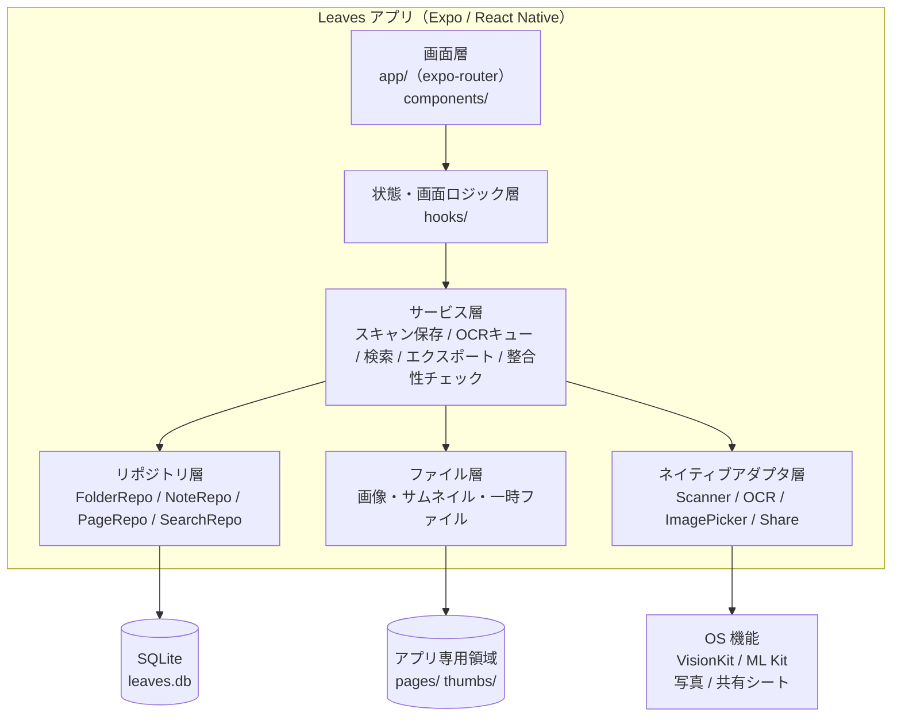
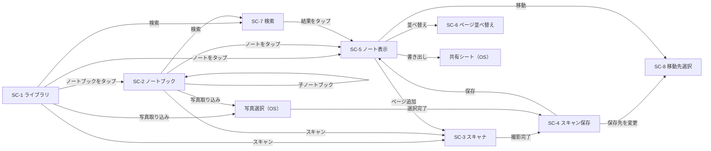
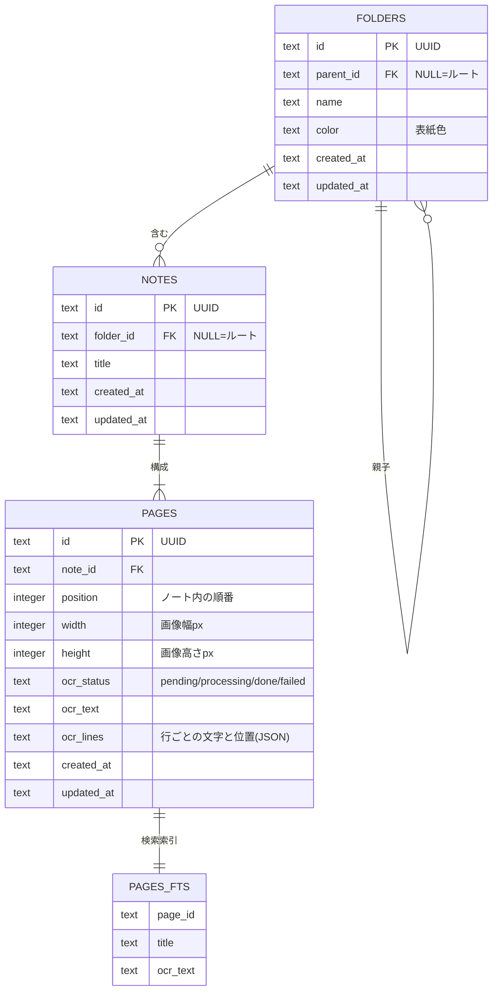
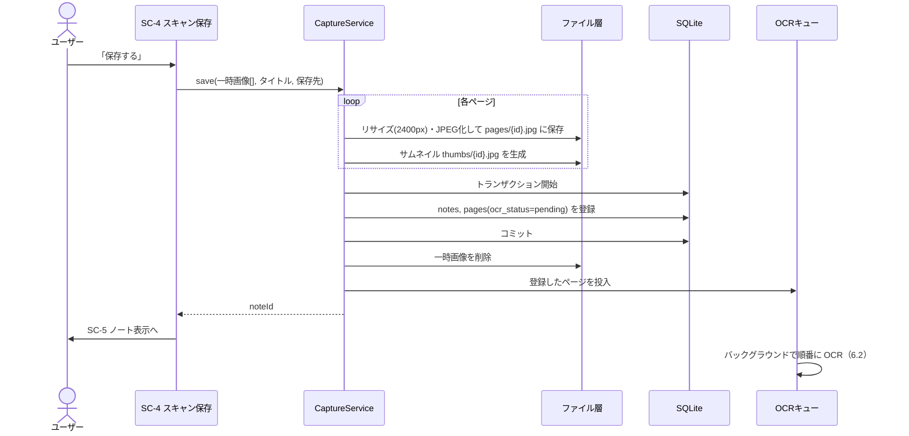
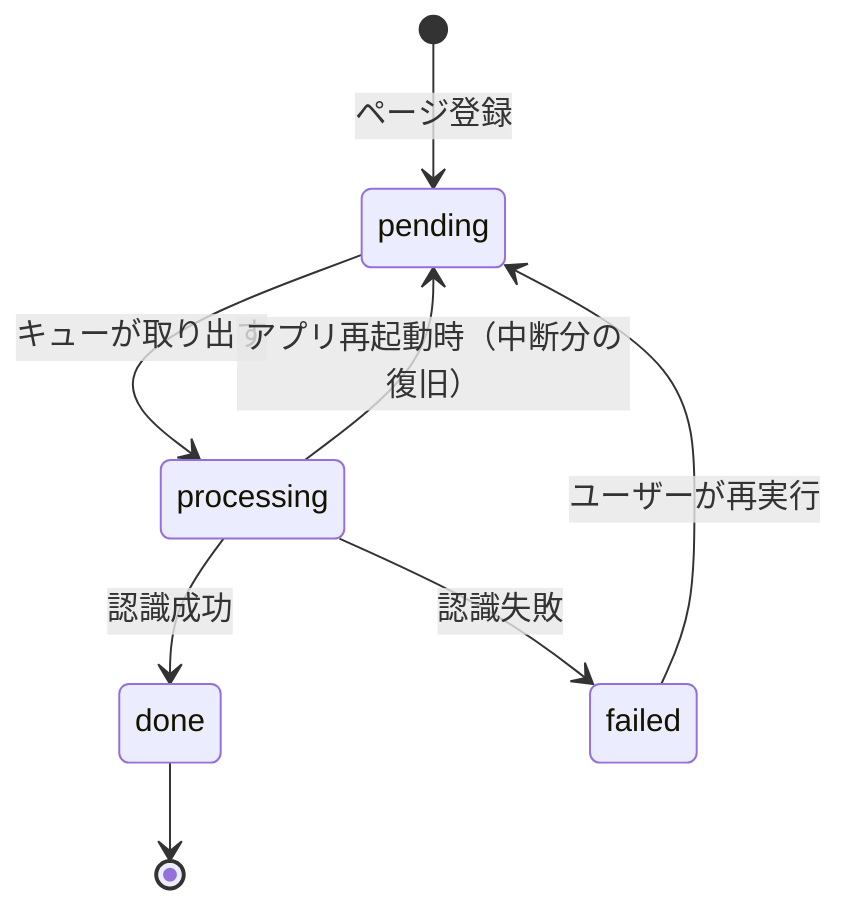

# Leaves 基本設計書

| 項目 | 内容 |
|---|---|
| 文書名 | Leaves 基本設計書 |
| 版数 | 1.0 |
| 作成日 | 2026-09-28 |
| 作成者 | SasaBranch |
| ステータス | 確定 |
| 入力文書 | [要件定義書 v1.1](../01_requirements/requirements.md) |

### 改訂履歴

| 版数 | 日付 | 内容 |
|---|---|---|
| 0.1 | 2026-09-28 | 初版作成 |
| 1.0 | 2026-09-28 | レビュー完了、確定 |

---

## 1. はじめに

### 1.1 本書の目的
要件定義書で定めた機能要件・非機能要件を実現するための、システム構成・画面・データ・処理の **外部から見た設計** を定める。クラス・関数・SQL などの内部設計は詳細設計書で扱う。

### 1.2 要件定義書の未決事項の決定

| No | 未決事項 | 決定内容 |
|---|---|---|
| Q-1 | 最低対応OS | **iOS 16.4 以上 / Android 10（API 29）以上**。Expo SDK 57 の iOS 最低要件（16.4）に合わせる |
| Q-2 | 保存画像の解像度・圧縮率 | **長辺 2400px・JPEG 品質 0.8**（1ページ約 0.5〜1MB）。一覧用サムネイルは別途 長辺 480px を生成 |
| Q-3 | PDF への OCR テキスト埋め込み | **埋め込む**。OCR の行位置に透明テキストを重ね、PDF 内検索・コピーを可能にする |
| Q-4 | 取り込み画像の輪郭補正 | **補正しない**（両OSでそのまま保存）。補正は将来の画像編集機能で扱う |

### 1.3 UI上の呼称
内部データとしては「フォルダ」だが、**UI上は「ノートブック」と表示する**。フォルダ階層を意識させず、ノート・冊子を並べた本棚として見せるため（2章のデザイン方針）。

| 内部（本書・コード） | UI表示 |
|---|---|
| フォルダ（folder） | ノートブック |
| ルート | ライブラリ |
| ノート（note） | ノート |
| ページ（page） | ページ |

---

## 2. デザイン方針

デザインモックは Claude Design で作成済み（5画面 × ダーク/ライト）。本章はそのモックを仕様として固定する。

### 2.1 コンセプト
- **本棚のように見せる**: フォルダはアイコンではなく「色付き表紙＋紙が重なった冊子」、ノートは「1ページ目のサムネイル＝紙の表紙」として並べる
- **階層を主張しない**: ツリー表示・パンくず帯は置かず、戻るボタンに親の名前を表示する程度に留める
- **スキャンまでの距離を最短に**: 一覧系画面の下部に常にフローティングアクションバー（写真取り込み＋スキャン）を置く
- **紙は紙のまま**: ダークモードでもノートのサムネイル・ページは紙色で表示する

### 2.2 カラートークン
テーマは **OS の設定（ライト/ダーク）に追従** する。アプリ内の切り替えは設けない。

| トークン | 用途 | ダーク | ライト |
|---|---|---|---|
| `bg` | 画面背景 | `#0E1310` | `#F6F7F3` |
| `stage` | ノート表示画面の背景 | `#0A0E0B` | `#E9ECE7` |
| `surface` | カード・シート | `#161D18` | `#FFFFFF` |
| `surface2` | 入力欄・二次ボタン | `#1D2620` | `#EBEFE9` |
| `border` | 区切り線・枠 | `#29342C` | `#DFE5DD` |
| `text` | 本文 | `#E7ECE8` | `#17201A` |
| `muted` | 補足テキスト | `#97A49B` | `#5B685F` |
| `accent` | 主ボタン・選択状態 | `#5FD08E` | `#1E7F48` |
| `onAccent` | accent 上の文字 | `#08240F` | `#FFFFFF` |
| `accentText` | リンク・強調文字 | `#7EDDA5` | `#1E7F48` |
| `accentSoft` | 検索ハイライト・状態チップ背景 | `rgba(95,208,142,0.16)` | `#DDF0E4` |
| `paper` | 紙（サムネイル・ページ背景） | `#F3F0E6` | `#FFFEFA` |

ノートブックの表紙色は次の6色から選択（作成時に自動で順番に割り当て、変更可能）:
`#2F5D45`（モス） / `#2D5461`（ティール） / `#6A4E38`（ブラウン） / `#4B7A5F`（リーフ） / `#3C4A5E`（スレート） / `#7A3E3E`（ワイン）

### 2.3 タイポグラフィ

| 用途 | フォント | 備考 |
|---|---|---|
| ロゴ・大きな数字 | Fraunces（600） | 「Leaves」ワードマーク |
| UI全般 | Zen Kaku Gothic New（400/500/700） | 見出し 26px / 本文 15px / 補足 11〜13px |

※ モックの手書き表現（Klee One）はダミーデータ用であり、実アプリではスキャン画像そのものが表示される。

### 2.4 共通コンポーネント

| コンポーネント | 仕様 |
|---|---|
| ノート表紙（NoteCover） | 1ページ目のサムネイルを 3:4 で表示、角丸 5px、影付き。右下にページ数バッジ（例: `5p`）。下にタイトル（1行省略）と日付 |
| ノートブック表紙（NotebookCover） | 表紙色の 3:4 カード。左に背表紙（暗い帯）、上部に白いラベルに名前、背後に紙が2枚重なった表現。下に名前と「N ノート」 |
| フローティングアクションバー | 画面下中央のカプセル。左: 写真取り込み（円形・二次色）、右: 「スキャン」（accent 色の大ボタン） |
| ボトムシート | ノート表示画面の文字認識テキスト・操作ボタンを格納。角丸 22px、ドラッグで展開 |
| アイコン | lucide（線アイコン、線幅 1.8〜2） |

タップ領域は最小 44×44pt を確保する。

---

## 3. システム構成

### 3.1 全体構成
外部サーバーを持たない **端末内完結型** のアプリ。すべてのデータは端末のアプリ専用領域に保存する。



| 層 | 責務 | 依存してよい層 |
|---|---|---|
| 画面層 | 表示とユーザー操作の受け付け | 状態・画面ロジック層 |
| 状態・画面ロジック層 | 画面に必要なデータの取得・更新通知の購読 | サービス層、リポジトリ層（参照のみ） |
| サービス層 | 複数のリポジトリ・ファイル・ネイティブ機能をまたぐ業務処理 | リポジトリ層、ファイル層、ネイティブアダプタ層 |
| リポジトリ層 | SQLite への読み書き（1テーブル群＝1リポジトリ） | なし（DB のみ） |
| ファイル層 | 画像の保存・削除・パス解決 | なし（ファイルシステムのみ） |
| ネイティブアダプタ層 | 外部ライブラリの呼び出しを包む（差し替え・テスト用のモックを可能にする） | なし（ライブラリのみ） |

### 3.2 技術スタック

| 分類 | 採用 | 用途 |
|---|---|---|
| フレームワーク | Expo SDK 57 / React Native / TypeScript（strict） | アプリ基盤 |
| 画面遷移 | expo-router | ファイルベースルーティング |
| データベース | expo-sqlite | メタデータ保存、FTS5 全文検索 |
| ファイル | expo-file-system | 画像の保存・削除 |
| 画像処理 | expo-image-manipulator | リサイズ・JPEG 圧縮・サムネイル生成 |
| 画像表示 | expo-image | サムネイルのキャッシュ付き表示 |
| スキャン | react-native-document-scanner-plugin | iOS: VisionKit / Android: ML Kit Document Scanner |
| OCR | @react-native-ml-kit/text-recognition | 日本語認識（両OS） |
| 写真取り込み | expo-image-picker | 複数選択 |
| 一覧表示 | @shopify/flash-list | 大量件数でも高速なリスト・グリッド |
| ジェスチャー | react-native-gesture-handler / react-native-reanimated | ピンチズーム、ページ並べ替え、ボトムシート |
| PDF 生成 | pdf-lib + @pdf-lib/fontkit | 画像＋透明テキストの PDF 生成 |
| PDF 用フォント | Noto Sans JP（アプリに同梱） | 透明テキストの日本語グリフ（サブセット埋め込み） |
| zip 生成 | jszip | Markdown エクスポート |
| 共有 | expo-sharing | OS 共有シート |
| アイコン | lucide-react-native | 線アイコン |
| テスト | Jest（jest-expo） | 単体テスト |

※ 各ライブラリの具体的なバージョンは実装開始時に固定し、詳細設計書に記載する。

### 3.3 実行環境・ビルド

| 項目 | 内容 |
|---|---|
| 対応OS | iOS 16.4 以上 / Android 10（API 29）以上 |
| ビルド | 開発ビルド（`npx expo run:ios` / `npx expo run:android`）。EAS などの有料サービスは使わない |
| 動作確認 | 画面・データ系: シミュレータ/エミュレータ、スキャン: 実機 |
| 通信 | 行わない（ネットワーク権限を使う機能・SDK を含めない） |

---

## 4. 画面設計

### 4.1 画面一覧

| ID | 画面名 | ルート | 表示形式 | 関連要件 |
|---|---|---|---|---|
| SC-1 | ライブラリ | `/` | 通常 | FR-F-01,07〜08, FR-N-09 |
| SC-2 | ノートブック | `/folder/[id]` | 通常 | FR-F-01〜09, FR-N-09 |
| SC-3 | スキャナ | （OS 標準 UI） | 全画面 | FR-S-01〜04 |
| SC-4 | スキャン保存 | `/capture` | モーダル | FR-S-05〜07 |
| SC-5 | ノート表示 | `/note/[id]` | 通常 | FR-N-01〜08, FR-O-05〜06, FR-E-01〜04 |
| SC-6 | ページ並べ替え | `/note/[id]/reorder` | モーダル | FR-N-07〜08 |
| SC-7 | 検索 | `/search` | モーダル | FR-Q-01〜05 |
| SC-8 | 移動先選択 | `/move` | モーダル | FR-F-04, FR-N-04, FR-S-06 |

SC-1 と SC-2 は同じ画面部品を使い、ルート（フォルダ ID なし）かどうかでヘッダーのみ切り替える。
設定画面は設けない（テーマは OS 追従、画質は固定のため設定項目がない）。

### 4.2 画面遷移



### 4.3 各画面の仕様

#### SC-1 ライブラリ / SC-2 ノートブック

| 領域 | SC-1 ライブラリ | SC-2 ノートブック |
|---|---|---|
| ヘッダー左 | 「Leaves」ロゴ | 戻る（親の名前を表示） |
| ヘッダー右 | その他メニュー | 検索（この中を検索）、その他メニュー |
| 見出し | 検索バー（タップで SC-7） | 表紙＋名前＋「N ノート · N ページ · 更新日」 |
| 上段 | 最近のノート（更新日時順 最大10件、横スクロール） | 子ノートブック（チップ形式、横スクロール）＋追加ボタン |
| 本体 | ノートブック（3列グリッド）→ ノート（3列グリッド） | ノート（2列グリッド）。グリッド/リスト表示切り替え |
| 並び順 | 更新順 / 名前順（ノートブックが常に先） | 同左 |
| 下部 | フローティングアクションバー | 同左 |

- **長押しメニュー**（ノートブック）: 名前を変更 / 表紙の色 / 移動 / 削除
- **長押しメニュー**（ノート）: 名前を変更 / 移動 / 書き出し / 削除
- **その他メニュー**: 新しいノートブック / 並び順
- ノートブック削除時は「中のノートブック N 件・ノート N 件もすべて削除されます」と件数を表示して確認する（FR-F-05）
- 空の状態: 「右下のスキャンから最初のノートを作りましょう」と案内を表示

#### SC-3 スキャナ
OS 標準スキャナ UI をそのまま使う（輪郭検出・台形補正・四隅調整・複数ページ・撮り直しは OS 側の機能）。キャンセル時は元の画面に戻り、何も保存しない。

#### SC-4 スキャン保存

| 領域 | 内容 |
|---|---|
| ヘッダー | 閉じる（破棄確認あり）、「スキャン完了」 |
| 件数 | 「N ページを取り込みました」 |
| ページ一覧 | 横スクロールのサムネイル（番号付き）。長押しドラッグで並べ替え、×で除外。末尾に「追加で撮影」 |
| タイトル | 初期値 `YYYY-MM-DD HH:mm`（FR-S-07）。タップで編集 |
| 保存先 | 開いていたノートブック（FR-S-06）。タップで SC-8 |
| 注記 | 「保存後、端末内で文字認識を行います（通信なし）」 |
| 主ボタン | 「保存する」→ 保存処理（6.1）→ SC-5 へ置き換え遷移 |

既存ノートへのページ追加（FR-N-06）の場合は、タイトル・保存先を表示せず、ボタンを「N ページを追加」とする。

#### SC-5 ノート表示

| 領域 | 内容 |
|---|---|
| ヘッダー | 戻る、タイトル（タップで名前変更）、所属パス・更新日時、共有（書き出しメニュー） |
| ページ | 紙画像を画面幅いっぱいに表示。左右スワイプでページ移動、ピンチで拡大（FR-N-01〜02） |
| ページ帯 | 小サムネイル列（現在ページを accent 枠）＋「2 / 5」 |
| ボトムシート（折りたたみ） | 文字認識テキスト（2行）、状態チップ、コピー |
| ボトムシート（展開） | 全文表示・テキスト選択可。失敗時は「再実行」ボタン（FR-O-05） |
| 操作 | ページ追加 / 並べ替え / 書き出し / 移動 |
| 書き出しメニュー | PDF で書き出し / Markdown で書き出し / このページの画像を共有 |

OCR 状態チップの表示:

| 状態 | 表示 |
|---|---|
| pending | 「認識待ち」（muted） |
| processing | 「認識中…」（スピナー） |
| done | 「認識済み」（accentSoft） |
| failed | 「認識できませんでした」＋ 再実行 |

#### SC-6 ページ並べ替え
2列グリッドでページを表示。長押しドラッグで並べ替え、各ページの削除ボタン。「完了」で確定。最後の1ページを削除しようとした場合は「ノートごと削除しますか？」と確認する（FR-N-08）。

#### SC-7 検索

| 領域 | 内容 |
|---|---|
| 検索欄 | 自動フォーカス。入力後 300ms で検索（デバウンス） |
| 範囲チップ | 「すべて」＋ルート直下のノートブック。SC-2 から開いた場合はそのノートブックを初期選択（FR-Q-05） |
| 件数 | 「「キーワード」を含むページ N 件」 |
| 結果行 | サムネイル、ノート名、ページ番号、所属パス、一致箇所の前後テキスト（一致部分を accentSoft で強調） |
| タップ | SC-5 を該当ページを開いた状態で表示（FR-Q-04） |

結果は **ページ単位** で表示する（同じノートの複数ページが一致すれば複数行）。タイトルのみ一致したノートは1ページ目を結果として表示する。

#### SC-8 移動先選択
ライブラリをルートとしたノートブックのツリーを表示し、1つを選択する。フォルダ移動時は、移動対象自身とその子孫を選択不可（グレー表示）にする（FR-F-04）。「新しいノートブック」をここからも作成できる。

---

## 5. データ設計

### 5.1 ER 図



### 5.2 テーブル概要

| テーブル | 概要 | 主な制約 |
|---|---|---|
| folders | ノートブック。`parent_id` による隣接リストで無制限の階層を表現 | 同じ親の下で `name` 一意（FR-F-06）。親削除で子も削除（CASCADE） |
| notes | ノート | フォルダ削除で削除（CASCADE） |
| pages | ページ。画像ファイル名は `{id}.jpg` で決まるため、パスは保存しない | ノート削除で削除（CASCADE）。`(note_id, position)` 一意 |
| pages_fts | FTS5 仮想テーブル（trigram トークナイザ）。ページ単位でノートタイトルと OCR テキストを索引 | pages・notes の更新に合わせて同期 |

- ID はすべて UUID v4、日時はすべて ISO 8601（UTC）の文字列とする（NFR-M-03）
- ルートは `parent_id` / `folder_id` が NULL で表す（ルート用のレコードは作らない）
- `ocr_lines` には OCR の行単位の結果 `[{ text, x, y, w, h }]`（画像に対する 0〜1 の相対座標）を保存し、PDF の透明テキスト配置に使う
- スキーマのバージョンは SQLite の `PRAGMA user_version` で管理し、起動時に順番にマイグレーションを適用する（NFR-M-04）
- 物理設計（型・インデックス・トリガー・SQL）は詳細設計書で定める

### 5.3 検索方式
trigram トークナイザは3文字未満の語を扱えないため、キーワード長で方式を切り替える（FR-Q-02）。

| キーワード長 | 方式 |
|---|---|
| 3文字以上 | `pages_fts` に対する FTS5 検索（高速） |
| 1〜2文字 | `pages` / `notes` に対する `LIKE '%…%'` 検索 |

一致箇所の前後テキストは、取得した OCR テキストからアプリ側で切り出す（前後各20文字程度）。

### 5.4 ファイル構成

```
<documentDirectory>/
├── leaves.db              … SQLite データベース
├── pages/{pageId}.jpg     … ページ画像（長辺 2400px, JPEG 0.8）
└── thumbs/{pageId}.jpg    … サムネイル（長辺 480px, JPEG 0.7）

<cacheDirectory>/
├── capture/               … スキャン直後の一時画像（保存・破棄で削除）
└── export/                … 書き出し用の一時ファイル（共有後に削除）
```

- アプリ専用領域に置くため、他アプリからは参照できない（NFR-S-03）
- パスはアプリ更新で変わることがあるため、DB には保存せず、実行時に `pageId` から組み立てる

---

## 6. 処理設計

### 6.1 スキャン保存



- **画像ファイルを先に書き、DB は最後に1トランザクションで登録する**。途中で終了した場合は「DB に存在しない画像」だけが残り、起動時の整合性チェック（6.5）で削除される（NFR-R-01）
- 画像処理はページごとに行い、全ページ分のメモリを同時に持たない

### 6.2 OCR キュー



- アプリ内で **1ページずつ順番に** 処理する（同時実行しない。端末の負荷を抑えるため）
- アプリ起動時に `processing` のページを `pending` に戻し、`pending` をすべてキューに投入する（NFR-R-03）
- 認識結果は `ocr_text`（全文）と `ocr_lines`（行ごとの文字と位置）に保存し、`pages_fts` を更新する
- 画面は状態変更の通知を購読し、状態チップ・テキストを更新する
- OCR が失敗してもページ画像は変更しない（NFR-R-02）

### 6.3 削除
1. DB から対象を削除する（外部キーの CASCADE により、子フォルダ・ノート・ページも削除）
2. 削除されたページの画像・サムネイルを削除する

2 の途中で失敗しても、残った画像は整合性チェック（6.5）で削除される。

### 6.4 エクスポート

| 形式 | 生成方法 | 出力 |
|---|---|---|
| PDF | pdf-lib で1ページ＝1画像のPDFを生成。ページサイズは画像の縦横比を保ち幅を A4 幅（595pt）に合わせる。`ocr_lines` の各行を **透明テキスト（描画モード: 不可視）** で行の位置・幅に合わせて配置する。フォントは同梱の Noto Sans JP を使用文字のみサブセット埋め込み | `{タイトル}.pdf` |
| Markdown | jszip で `{タイトル}.md` と `images/p01.jpg…` を zip 化。md には各ページの画像リンクと OCR テキストを記載 | `{タイトル}.zip` |
| 画像 | 表示中ページの画像をそのまま共有 | `{タイトル}_p{N}.jpg` |

生成したファイルは `cacheDirectory/export/` に置き、expo-sharing で共有シートを開く。共有シートを閉じたら削除する。
ファイル名に使えない文字（`/ \ : * ? " < > |`）は `_` に置き換える。

Markdown の出力形式:

```markdown
# 第3回 固有値と固有ベクトル

- 作成日時: 2026-09-28 10:30
- ノートブック: 大学 / 線形代数

## ページ 1


§3 固有値と固有ベクトル
定義：Ax = λx (x ≠ 0)
…
```

### 6.5 起動時処理
1. DB を開き、マイグレーションを適用する
2. **整合性チェック**: `pages/` `thumbs/` 内で DB に存在しないファイルを削除する。DB に存在するが画像がないページは、ノート表示で「画像が見つかりません」と表示する
3. `cacheDirectory/capture/` `export/` の残骸を削除する
4. OCR キューを復旧する（6.2）

2〜4 は画面表示後にバックグラウンドで行い、起動時間に影響させない（NFR-P-01）。

### 6.6 フォルダ移動の検証
移動先が「移動対象自身またはその子孫」でないことを、再帰クエリで移動対象の子孫一覧を求めて確認する（FR-F-04）。移動先に同名のフォルダがある場合はエラーとし、名前の変更を促す（FR-F-06）。

---

## 7. エラー処理方針

| 状況 | 対応 | メッセージ例 |
|---|---|---|
| カメラの権限がない | 説明ダイアログ →「設定を開く」 | カメラへのアクセスが許可されていません。設定アプリから許可してください |
| 写真の権限がない | 同上 | 写真へのアクセスが許可されていません。… |
| スキャンをキャンセル | 何もせず元の画面へ | （表示なし） |
| 保存時の容量不足 | 保存を中止し、書き込み済みの画像を削除 | 端末の空き容量が不足しているため保存できませんでした |
| OCR 失敗 | ページの状態を failed にし、再実行ボタンを表示 | 文字を認識できませんでした |
| 同名のノートブック | 入力画面に留まる | 同じ場所に同じ名前のノートブックがあります |
| 書き出し失敗 | 一時ファイルを削除 | 書き出しに失敗しました。もう一度お試しください |
| 予期しない例外 | 画面全体のエラー境界で捕捉し、再読み込みボタンを表示 | 問題が発生しました |

エラー内容は開発ビルドではコンソールに出力する。外部へのエラー送信は行わない（NFR-S-02）。

---

## 8. 非機能要件への対応

| 要件 | 設計上の対応 |
|---|---|
| NFR-P-01 起動 2秒 | 整合性チェック・OCR 復旧を画面表示後に実行（6.5） |
| NFR-P-02 一覧 1秒 | サムネイル（480px）を別に保存し、一覧では原寸画像を読まない。FlashList で表示分だけ描画 |
| NFR-P-03 検索 1秒 | FTS5 trigram 索引（5.3）。結果は最大100件で打ち切り |
| NFR-P-04 保存後 2秒 | OCR は保存と切り離しキューで実行（6.1〜6.2） |
| NFR-P-06 1MB/ページ | 長辺 2400px・JPEG 0.8 |
| NFR-R-01 不整合なし | 画像を先に保存 → DB を1トランザクションで登録 → 起動時に孤立ファイルを削除 |
| NFR-R-02/03 OCR | 状態管理と起動時の復旧（6.2） |
| NFR-S-01/02 オフライン | 通信する機能・解析 SDK を含めない。依存ライブラリ追加時に確認する |
| NFR-S-04 権限 | スキャン・取り込みボタンを押した時点で権限を要求 |
| NFR-U-01 2タップ | フローティングアクションバーから1タップでスキャナ起動 |
| NFR-U-03 ダークモード | 2.2 のトークンを OS 設定に応じて切り替え |
| NFR-M-02 テスト | リポジトリ層・サービス層を単体テスト。ネイティブ機能はアダプタ層をモックに差し替え |

---

## 9. ソースコード構成（概要）

```
Leaves/
├── app/                 … 画面（expo-router のルート）
│   ├── index.tsx        … SC-1
│   ├── folder/[id].tsx  … SC-2
│   ├── note/[id].tsx    … SC-5
│   ├── note/[id]/reorder.tsx … SC-6
│   ├── capture.tsx      … SC-4
│   ├── search.tsx       … SC-7
│   └── move.tsx         … SC-8
├── src/
│   ├── components/      … 共通部品（NoteCover, NotebookCover, ActionBar …）
│   ├── hooks/           … 画面ロジック
│   ├── services/        … サービス層
│   ├── db/              … リポジトリ・マイグレーション
│   ├── storage/         … ファイル層
│   ├── native/          … ネイティブアダプタ層
│   └── theme/           … カラートークン・タイポグラフィ
├── assets/fonts/        … Fraunces, Zen Kaku Gothic New, Noto Sans JP（PDF 用）
└── docs/                … 設計書
```

詳細（ファイル単位の責務・主要な型）は詳細設計書で定める。

---

## 10. 要件トレーサビリティ

| 要件 | 画面 | 処理・データ |
|---|---|---|
| FR-F-01〜09 | SC-1, SC-2, SC-8 | folders、6.6 |
| FR-S-01〜04 | SC-3 | Scanner アダプタ |
| FR-S-05〜08 | SC-4 | 6.1、ImagePicker アダプタ、7章 |
| FR-O-01〜06 | SC-5 | 6.2、pages.ocr_* |
| FR-N-01〜09 | SC-1, SC-2, SC-5, SC-6 | notes, pages、6.3 |
| FR-Q-01〜05 | SC-7 | pages_fts、5.3 |
| FR-E-01〜04 | SC-5 | 6.4 |

---

## 11. 技術的なリスクと事前検証

実装フェーズの最初に、以下を小さな試作で検証する。問題があれば本書を改訂する。

| No | リスク | 検証内容 | 代替案 |
|---|---|---|---|
| R-1 | expo-sqlite に同梱の SQLite で FTS5 trigram が使えない | trigram テーブル作成と日本語検索の動作 | 2-gram を自前で生成して通常の FTS5 に格納 |
| R-2 | pdf-lib で日本語フォントのサブセット埋め込みが遅い・メモリ不足 | 10ページ・日本語 2,000 文字の PDF 生成時間 | 透明テキストを省略した PDF にフォールバック |
| R-3 | スキャナプラグインの出力形式・画質が OS で異なる | 両 OS で出力画像のサイズ・形式を確認 | 出力後の正規化処理で吸収 |
| R-4 | ML Kit の日本語モデル追加によるアプリサイズ増加 | ビルド後のアプリサイズ | 許容（個人利用のため） |
| R-5 | ページ並べ替え（ドラッグ）ライブラリと Expo SDK 57 の互換性 | 動作確認 | reanimated で自前実装 |

---

## 12. 詳細設計への申し送り

- テーブルの物理設計（型、インデックス、トリガー、FTS 同期方法）と SQL
- 各サービス・リポジトリの関数仕様と型定義
- 状態管理と変更通知の方式（画面間でのデータ更新の反映方法）
- ページ並べ替え・ズーム・ボトムシートに使うライブラリの確定
- PDF の透明テキスト配置の計算方法（フォントサイズ・横幅の合わせ方）
- テスト方針（単体テストの範囲、テストデータ 1,000 ノートの生成方法）
