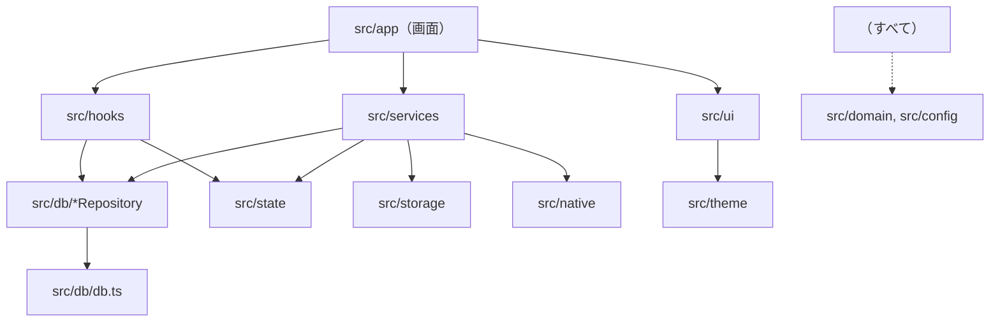

# Leaves 詳細設計書

| 項目 | 内容 |
|---|---|
| 文書名 | Leaves 詳細設計書 |
| 版数 | 1.5 |
| 作成日 | 2026-09-28 |
| 作成者 | SasaBranch |
| ステータス | 確定 |
| 入力文書 | [要件定義書 v1.1](../01_requirements/requirements.md) / [基本設計書 v1.0](../02_basic-design/basic-design.md) / [ADR](../adr/README.md) |

### 改訂履歴

| 版数 | 日付 | 内容 |
|---|---|---|
| 0.1 | 2026-09-28 | 初版作成 |
| 1.0 | 2026-09-28 | レビュー完了、確定 |
| 1.1 | 2026-09-28 | 画面の置き場所を `app/` から `src/app/` に変更（Expo SDK 57 のテンプレート構成に合わせる。#1） |
| 1.2 | 2026-09-28 | 4.3 Db 型を ADR 0011（順番待ち・tx 引数・SqlDriver）に合わせて更新（#7） |
| 1.3 | 2026-09-28 | 9.2 iOS の文字認識を Apple Vision に変更（ADR 0013） |
| 1.4 | 2026-09-28 | 8 章 画面用フックを実装に合わせて更新（M3） |
| 1.5 | 2026-09-28 | 12 章 テストデータ生成の扱いを実装に合わせて更新（#32） |

---

## 1. 本書の位置づけ

### 1.1 本書に書くこと・書かないこと
**コードそのものが最終的な設計書である**。自然言語の設計書は曖昧さを許してしまい、コードにした瞬間に初めて曖昧さが表に出る。そのため本書は、コードを書く前に決めておかないと手戻りが大きいもの、コードだけでは読み取りにくいものに絞る。

| 書くこと | 書かないこと |
|---|---|
| モジュールの責務と依存の向き | 各関数の実装手順（コードに書く） |
| 型（モジュール間の約束） | UI 部品の細かなスタイル（基本設計書 2 章とコードに書く） |
| DB の物理設計（DDL・トリガー・主要 SQL） | コードを読めば分かる処理の逐語的な説明 |
| 処理の流れのうち、順番に意味があるもの（整合性・状態遷移） | |
| 名前付き定数とその意味 | |
| 設計原則をこのプロジェクトでどう適用するか | |

### 1.2 設計判断の記録
設計判断は [ADR](../adr/README.md) に記録する。本書と ADR が食い違う場合は新しい ADR を優先する。本書の執筆にあたり、次の判断を ADR に記録した。

| ADR | 本書への影響 |
|---|---|
| [0004](../adr/0004-fulltext-search-trigram.md) 検索経路を1本にする | 基本設計書 5.3 の2方式切り替えを、trigram テーブルへの LIKE 1本に置き換え（6.4） |
| [0007](../adr/0007-notebook-ubiquitous-language.md) notebook に統一 | 基本設計書の `folders` / `folder_id` を `notebooks` / `notebook_id` に置き換え（2 章・6 章） |
| [0008](../adr/0008-db-access-wrapper-for-tests.md) DB ラッパー | リポジトリは `Db` 型を受け取る（4.3・10 章） |

---

## 2. 用語とコード上の名前

UI・仕様・コードで同じ言葉を使う（ADR 0007）。

| 概念 | UI 表示 | コード上の名前 | 補足 |
|---|---|---|---|
| ノートブック | ノートブック | `Notebook` / `notebooks` / `notebookId` | 要件定義書の「フォルダ」 |
| ライブラリ | ライブラリ | `notebookId === null` | 最上位。レコードは持たない |
| ノート | ノート | `Note` / `notes` / `noteId` | 1枚以上のページを持つ |
| ページ | ページ | `Page` / `pages` / `pageId` | 画像1枚＋OCR 結果 |
| 取り込み画像 | — | `CapturedImage` | スキャン・写真選択で得た、保存前の一時画像 |
| ページ画像 | — | `pageImage` | 保存済みの原寸画像（長辺 2400px） |
| サムネイル | — | `thumbnail` | 一覧用の縮小画像（長辺 480px） |
| 文字認識 | 文字認識 | `ocr` | |
| 認識行 | — | `OcrLine` | OCR の1行分の文字と位置 |
| 書き出し | 書き出し | `export` | |

### 命名規則
- **関数は動詞から始める**（`createNote`, `findNotesInNotebook`）。取得系は、1件なら `get`（なければ例外）/ `find`（なければ `null`）、複数なら `list` とする
- **真偽値は `is` / `has` / `can` で始める**（`isRoot`, `canMoveNotebook`）
- **副作用の範囲を名前で隠さない**。中身ごと消える削除は `deleteNotebookWithContents` とし、`deleteNotebook` のように一部しか消えないように見える名前にしない
- **略語は使わない**。例外は業界で定着している `id` `url` `ocr` `pdf` `uri` のみ
- ファイル名: 部品・画面は PascalCase（`NoteCover.tsx`）、それ以外は camelCase（`noteRepository.ts`）

---

## 3. 設計原則の適用方針

プログラミングの原理原則を、このプロジェクトで具体的にどう守るかを定める。原則同士は緊張関係にある（例: DRY と KISS、OCP と YAGNI）。共通する規律は **「まだ起きていない未来の予測に、今の複雑さを賭けない」** である。

### 3.1 KISS（絡み合わせない）
- 状態管理ライブラリ（Redux・Zustand 等）は使わない。画面のデータは SQLite から取得し、React の state に置く。データ変更の通知は 7 章の小さな仕組み1つで行う
- クラスは使わず、**関数とモジュール**で構成する（例外を表す `Error` の拡張と、ライブラリが要求する場合を除く）
- 意味のある数値はすべて名前付き定数にする（11 章）。マジックナンバーを書かない
- 1つの関数は1つのことをする。名前に「と」「And」が必要になったら分割のサイン

### 3.2 DRY（知識を1か所に）
「見た目が同じコード」ではなく **「同じ知識」** を1か所にまとめる。

| 知識 | 唯一の置き場所 |
|---|---|
| DB スキーマ | `src/db/migrations.ts`（追記のみ） |
| 画面の色・フォント | `src/theme/tokens.ts` |
| ファイルの保存場所 | `src/storage/paths.ts` |
| ページ画像を保存する手順（リサイズ・サムネイル生成） | `src/storage/pageImages.ts` の `storePageImages`。新規ノート作成とページ追加の両方がこれを使う |
| OCR 状態の種類 | `src/domain/types.ts` の `OcrStatus` と DDL の CHECK 制約（6.2 で両者の一致をテストする） |
| エラー → 表示文言の対応 | `src/ui/errorMessages.ts` |
| 検索索引の同期 | DB トリガー（6.3）。アプリ側から `pages_fts` を直接更新しない |

一方で、**似ているが別の知識は共通化しない**（間違った抽象化は重複より悪い）。例:
- スキャン保存画面のページ一覧（SC-4）とページ並べ替え画面（SC-6）は見た目が似ているが、目的（保存前の確認／保存済みの編集）と変わる理由が違うため、別の部品にする
- 3回目の重複が現れるまでは共通化を待つ（Rule of Three）

### 3.3 YAGNI（必要になってから作る）
MVP で作らないもの:
- 同期のためのコード（変更履歴テーブル、競合解決など）。要件で決まっている UUID と `updated_at` の列だけは持つ（安価で、後から追加すると全データの移行が必要になるため）
- 汎用リポジトリ基底（`Repository<T>` など）、DI コンテナ、プラグイン機構
- 設定画面、タグ、ゴミ箱の列やテーブル
- 使われない引数・オプション

抽象化を入れてよいのは、**今すでに2つ以上の実装が必要な場合**だけとする。本書で入れた抽象化は次の2つのみ。

| 抽象化 | 今ある2つの実装 |
|---|---|
| `Db` 型（ADR 0008） | expo-sqlite（アプリ）/ better-sqlite3（テスト） |
| ネイティブアダプタ（`src/native/`） | 実ライブラリ（アプリ）/ Jest のモック（テスト） |

### 3.4 OCP（拡張に開き、修正に閉じる）
最初から拡張点を用意しない。分岐が増えて3つ目のバリエーションが来たときに、実際のコードから抽象の形を見つけて移行する。
- 書き出し形式は、MVP の時点で PDF・Markdown・画像の3つがある。共通の手順（ファイルを作る → 共有シートを開く → 一時ファイルを消す）を `shareExport` に、形式ごとの違い（ファイルの作り方）を形式ごとの関数に分ける（9.5）。形式を追加するときは、関数を1つ追加して対応表に1行足すだけで済む

### 3.5 SLAP（抽象度を揃える）
- サービス層の公開関数は、**処理の段落を並べた「目次」** として書く。各段落の中身（ループ・条件分岐の塊）は名前付きの関数に切り出す（9.1 の例）
- 画面コンポーネントは「データ取得フック＋表示部品の組み立て」だけを書き、SQL・ファイル操作を直接書かない
- 1行で意図が表せる処理（代入、単一の API 呼び出し）は無理に関数にしない

### 3.6 PIE・名前重要（意図を表現する）
- 2 章の用語と命名規則に従う
- コメントは「なぜ」を書く（何をしているかは名前で表す）。「何をしているか」のコメントを書きたくなったら、そのコメントを名前にして関数に切り出す
- 型で意図を表す。例: ID は `NotebookId` `NoteId` `PageId` と別々の型にし、取り違えをコンパイル時に防ぐ

### 3.7 コードは必ず変更される
- 設計判断は ADR に残す（1.2）
- DB スキーマの変更は、既存のマイグレーションを書き換えず、新しいマイグレーションを追加する
- 変更が起きやすい部分（UI、書き出し形式）と起きにくい部分（DB の整合性、ファイル保存）を別モジュールに分け、変更の影響を閉じ込める

---

## 4. モジュール構成

### 4.1 ディレクトリとファイルの責務

```
src/
├── app/                           … 画面（expo-router）。表示と操作の受け付けのみ
│   ├── _layout.tsx                … フォント読み込み、テーマ、DB 初期化、起動時処理の開始
│   ├── index.tsx                  … SC-1 ライブラリ
│   ├── notebook/[id].tsx          … SC-2 ノートブック
│   ├── note/[id].tsx              … SC-5 ノート表示
│   ├── note/[id]/reorder.tsx      … SC-6 ページ並べ替え
│   ├── capture.tsx                … SC-4 スキャン保存
│   ├── search.tsx                 … SC-7 検索
│   └── move.tsx                   … SC-8 移動先選択
├── domain/
│   └── types.ts                   … 型定義（5 章）
├── config.ts                      … 名前付き定数（11 章）
├── db/
│   ├── db.ts                      … Db 型・SqlDriver 型・createDb
│   ├── expoSqliteDriver.ts        … アプリ用 SqlDriver（expo-sqlite）
│   ├── migrations.ts              … スキーマ（追記のみ）
│   ├── notebookRepository.ts
│   ├── noteRepository.ts
│   ├── pageRepository.ts
│   └── searchRepository.ts
├── storage/
│   ├── paths.ts                   … 保存場所の組み立て
│   └── pageImages.ts              … ページ画像の保存・削除
├── native/                        … 外部ライブラリの薄い包み
│   ├── scanner.ts
│   ├── imagePicker.ts
│   ├── textRecognizer.ts
│   └── share.ts
├── services/
│   ├── capture.ts                 … ノート作成・ページ追加
│   ├── notebooks.ts               … ノートブックの作成・移動・削除
│   ├── notes.ts                   … ノートの移動・削除、ページの並べ替え・削除
│   ├── ocrQueue.ts                … OCR キュー
│   ├── integrity.ts               … 起動時の整合性チェック
│   └── export/
│       ├── shareExport.ts         … 書き出しの共通手順と形式の対応表
│       ├── pdf.ts
│       ├── markdown.ts
│       └── pageImage.ts
├── state/
│   └── dataChanges.ts             … データ変更の通知（7 章）
├── hooks/                         … 画面用のデータ取得（8 章）
├── ui/
│   ├── components/                … NoteCover, NotebookCover, ActionBar, OcrStatusChip …
│   └── errorMessages.ts
└── theme/
    ├── tokens.ts                  … 色・フォント（基本設計書 2.2〜2.3）
    └── useTheme.ts                … OS 設定に応じたトークンの選択

assets/fonts/                      … Fraunces, ZenKakuGothicNew, NotoSansJP（PDF 用）
test/                              … テスト用の Db 実装、テストデータ生成
```

### 4.2 依存の向き



- 矢印の逆向きの依存は禁止（例: リポジトリから services を呼ばない）
- **画面が DB を更新するときは必ず services を通す**。読み取りは hooks からリポジトリを直接呼んでよい（読み取りのためだけに services を挟むのは、中身のない中継関数を増やすだけのため）
- `src/native` と `src/storage` は互いに依存しない

### 4.3 Db 型（ADR 0008 / 0011）

```ts
export type SqlValue = string | number | null;

// リポジトリが使う DB 操作
export type Db = {
  run(sql: string, params?: SqlValue[]): Promise<void>;
  get<T>(sql: string, params?: SqlValue[]): Promise<T | null>;
  all<T>(sql: string, params?: SqlValue[]): Promise<T[]>;
  transaction(work: (tx: Db) => Promise<void>): Promise<void>; // 中の操作は tx で行う
};

// SQLite ライブラリごとの差を吸収する口
export type SqlDriver = {
  run(sql: string, params: SqlValue[]): Promise<void>;
  get<T>(sql: string, params: SqlValue[]): Promise<T | null>;
  all<T>(sql: string, params: SqlValue[]): Promise<T[]>;
};

export function createDb(driver: SqlDriver): Db;
```

- `createDb` は、すべての操作を1本の順番待ちに並べ、トランザクションを `BEGIN IMMEDIATE` / `COMMIT` / `ROLLBACK` で行う（ADR 0011）。アプリとテストで共通
- `SqlDriver` の実装はアプリ用 `src/db/expoSqliteDriver.ts`（expo-sqlite）とテスト用 `test/testDb.ts`（better-sqlite3）の2つ
- `Db` は4関数、`SqlDriver` は3関数から広げない

---

## 5. 型定義

`src/domain/types.ts` に置く。モジュール間の約束はこの型で表す。

```ts
// 取り違えを防ぐため、ID ごとに別の型にする
type Brand<T, Name> = T & { readonly __brand: Name };
export type NotebookId = Brand<string, 'NotebookId'>;
export type NoteId = Brand<string, 'NoteId'>;
export type PageId = Brand<string, 'PageId'>;

export type IsoDateTime = string; // ISO 8601（UTC）

export type Notebook = {
  id: NotebookId;
  parentId: NotebookId | null; // null はライブラリ直下
  name: string;
  color: NotebookColor;
  createdAt: IsoDateTime;
  updatedAt: IsoDateTime;
};

export type Note = {
  id: NoteId;
  notebookId: NotebookId | null;
  title: string;
  createdAt: IsoDateTime;
  updatedAt: IsoDateTime;
};

export const OCR_STATUSES = ['pending', 'processing', 'done', 'failed'] as const;
export type OcrStatus = (typeof OCR_STATUSES)[number];

// 画像に対する相対座標（0〜1）。画像サイズが変わっても使えるようにするため
export type OcrLine = { text: string; x: number; y: number; width: number; height: number };

export type Page = {
  id: PageId;
  noteId: NoteId;
  position: number; // ノート内の順番（0 始まり）
  width: number;    // 画像の幅（px）
  height: number;
  ocrStatus: OcrStatus;
  ocrText: string;
  ocrLines: OcrLine[];
  createdAt: IsoDateTime;
  updatedAt: IsoDateTime;
};

// 一覧表示用（ノート表紙に必要な情報をまとめて1回の SQL で取る）
export type NoteSummary = Note & { pageCount: number; coverPageId: PageId };
export type NotebookSummary = Notebook & { noteCount: number };

export type CapturedImage = { uri: string; width: number; height: number };

export type SearchHit = {
  noteId: NoteId;
  noteTitle: string;
  pageId: PageId;
  pagePosition: number;
  notebookPath: string[]; // 例: ['大学', '線形代数']
  snippet: { before: string; match: string; after: string };
};

export type SortOrder = 'updatedAt' | 'name';
```

`NotebookColor` は 11 章の `NOTEBOOK_COLORS` の要素の型とする。

---

## 6. データベース物理設計

### 6.1 接続設定
DB を開いた直後に毎回実行する。

```sql
PRAGMA foreign_keys = ON;    -- CASCADE 削除を有効にするため（SQLite は既定で無効）
PRAGMA journal_mode = WAL;   -- 書き込み中も読み取りを止めないため
```

### 6.2 テーブル（マイグレーション 1）

```sql
CREATE TABLE notebooks (
  id          TEXT PRIMARY KEY,
  parent_id   TEXT REFERENCES notebooks(id) ON DELETE CASCADE,
  name        TEXT NOT NULL CHECK (length(trim(name)) > 0),
  color       TEXT NOT NULL,
  created_at  TEXT NOT NULL,
  updated_at  TEXT NOT NULL
);
-- 同じ場所に同名のノートブックを作れない（FR-F-06）。
-- parent_id が NULL 同士は UNIQUE で区別されないため、空文字に置き換えて比較する
CREATE UNIQUE INDEX notebooks_unique_name ON notebooks (ifnull(parent_id, ''), name);

CREATE TABLE notes (
  id           TEXT PRIMARY KEY,
  notebook_id  TEXT REFERENCES notebooks(id) ON DELETE CASCADE,
  title        TEXT NOT NULL,
  created_at   TEXT NOT NULL,
  updated_at   TEXT NOT NULL
);
CREATE INDEX notes_by_notebook ON notes (notebook_id, updated_at DESC);

CREATE TABLE pages (
  id          TEXT PRIMARY KEY,
  note_id     TEXT NOT NULL REFERENCES notes(id) ON DELETE CASCADE,
  position    INTEGER NOT NULL,
  width       INTEGER NOT NULL,
  height      INTEGER NOT NULL,
  ocr_status  TEXT NOT NULL DEFAULT 'pending'
              CHECK (ocr_status IN ('pending', 'processing', 'done', 'failed')),
  ocr_text    TEXT NOT NULL DEFAULT '',
  ocr_lines   TEXT NOT NULL DEFAULT '[]',  -- OcrLine[] の JSON
  created_at  TEXT NOT NULL,
  updated_at  TEXT NOT NULL,
  UNIQUE (note_id, position)
);
CREATE INDEX pages_by_ocr_status ON pages (ocr_status);

CREATE VIRTUAL TABLE pages_fts USING fts5 (
  page_id UNINDEXED,
  title,
  ocr_text,
  tokenize = 'trigram'
);
```

- マイグレーションは `PRAGMA user_version` を見て、未適用のものを順番に1トランザクションずつ適用する
- `ocr_status` の CHECK 制約と `OCR_STATUSES` が一致していることをテストで確認する（知識の二重化をテストで縛る）

### 6.3 検索索引の同期（トリガー）
`pages_fts` はトリガーだけが更新する。アプリのコードから直接書き込まない（DRY: 同期の知識を DB に1か所）。

```sql
CREATE TRIGGER pages_fts_after_page_insert AFTER INSERT ON pages BEGIN
  INSERT INTO pages_fts (page_id, title, ocr_text)
  SELECT new.id, notes.title, new.ocr_text FROM notes WHERE notes.id = new.note_id;
END;

CREATE TRIGGER pages_fts_after_ocr_update AFTER UPDATE OF ocr_text ON pages BEGIN
  UPDATE pages_fts SET ocr_text = new.ocr_text WHERE page_id = new.id;
END;

CREATE TRIGGER pages_fts_after_page_delete AFTER DELETE ON pages BEGIN
  DELETE FROM pages_fts WHERE page_id = old.id;
END;

CREATE TRIGGER pages_fts_after_title_update AFTER UPDATE OF title ON notes BEGIN
  UPDATE pages_fts SET title = new.title
  WHERE page_id IN (SELECT id FROM pages WHERE note_id = new.id);
END;
```

CASCADE で削除されたページでも `AFTER DELETE ON pages` トリガーは実行される（`foreign_keys = ON` の場合）。これをテストで確認する。

### 6.4 主要な SQL

**ノートブックの子孫（移動の検証・範囲検索・削除件数に共通）**

```sql
WITH RECURSIVE subtree(id) AS (
  SELECT :notebookId
  UNION ALL
  SELECT notebooks.id FROM notebooks JOIN subtree ON notebooks.parent_id = subtree.id
)
SELECT id FROM subtree;
```

**ノートブック内のノート一覧（表紙情報つき）**

```sql
SELECT notes.*,
       count(pages.id) AS page_count,
       (SELECT id FROM pages p WHERE p.note_id = notes.id ORDER BY position LIMIT 1) AS cover_page_id
FROM notes
LEFT JOIN pages ON pages.note_id = notes.id
WHERE notes.notebook_id IS :notebookId      -- IS を使うことで NULL（ライブラリ直下）にも一致させる
GROUP BY notes.id
ORDER BY notes.updated_at DESC;             -- 名前順のときは notes.title COLLATE NOCASE
```

**検索（ADR 0004: 経路は1本）**

```sql
SELECT pages_fts.page_id, pages_fts.title, pages_fts.ocr_text,
       pages.position, notes.id AS note_id, notes.notebook_id
FROM pages_fts
JOIN pages ON pages.id = pages_fts.page_id
JOIN notes ON notes.id = pages.note_id
WHERE (pages_fts.title LIKE :pattern ESCAPE '\' OR pages_fts.ocr_text LIKE :pattern ESCAPE '\')
  AND (:scopeAll = 1 OR notes.notebook_id IN (/* 子孫 CTE */))
ORDER BY notes.updated_at DESC, pages.position
LIMIT :limit;
```

- `:pattern` は `%` + キーワード（`\` `%` `_` をエスケープ）+ `%`
- タイトルだけが一致したノートは複数ページが該当するため、アプリ側でノートごとに最初のページだけ残す
- 所属パス（`notebookPath`）はノートブック全件（数百件程度）をメモリに読み、ID から親をたどって組み立てる。SQL の再帰で1件ずつ求めるより単純で、件数的にも問題ない

### 6.5 ページの並べ替え
`UNIQUE (note_id, position)` があるため、位置を1件ずつ書き換えると途中で重複が起きる。1トランザクション内で、いったん全ページの位置を負の値に退避してから、新しい順番を書き込む。

```sql
UPDATE pages SET position = -(position + 1) WHERE note_id = :noteId;
-- 新しい順番で1件ずつ
UPDATE pages SET position = :newPosition, updated_at = :now WHERE id = :pageId;
```

---

## 7. データ変更の通知

画面間でデータの更新を反映する仕組み。`src/state/dataChanges.ts` に置く。

```ts
export function notifyDataChanged(): void;
export function subscribeDataChanged(listener: () => void): () => void; // 戻り値は購読解除
```

- services は DB を更新するトランザクションが **コミットされた後** に `notifyDataChanged()` を1回呼ぶ
- hooks は購読し、通知を受けたら自分のクエリを取り直す
- 通知は「何かが変わった」の1種類だけとする。どの画面も SQLite から数十〜百件程度を読み直すだけで十分速いため、変更の種類ごとの細かい通知は作らない（KISS・YAGNI）。性能問題が実測で出たら細分化する

---

## 8. 画面用フック

`src/hooks/` に置く。画面はこれらと services だけを使う。

| フック | 返す値 | 使う画面 |
|---|---|---|
| `useLibrary(sort)` | `{ recentNotes, notebooks, notes }` | SC-1 |
| `useNotebook(id, sort)` | `{ notebook, parentName, childNotebooks, notes, pageCount }` | SC-2 |
| `useNote(id)` | `{ note, pages, notebookPath }` | SC-5, SC-6 |
| `useSearch(keyword, scope)` / `useSearchScopes(scope)` | `{ hits, searchedKeyword, isSearching }` / 範囲チップ用のノートブック | SC-7 |
| `useNotebookTree(movingNotebookId)` | `{ roots, unselectableIds }`（移動対象とその子孫は選べない） | SC-8 |
| `useCaptureLauncher(target)` | `{ scan, importPhotos }`（新しいノートを作る／既存ノートにページを足す） | SC-1, SC-2, SC-5 |
| `useItemMenus()` | 長押しメニュー・名前入力ダイアログを開く関数と、その描画要素 | SC-1, SC-2 |

- すべてのフックは `subscribeDataChanged` を購読し、変更時に取り直す
- 取得中は前回の値を表示し続ける（画面のちらつきを防ぐため）

---

## 9. 主要処理の詳細

### 9.1 ノート作成・ページ追加（`services/capture.ts`）

```ts
export async function createNoteFromCapture(input: {
  images: CapturedImage[];
  title: string;
  notebookId: NotebookId | null;
}): Promise<NoteId>;

export async function addPagesToNote(noteId: NoteId, images: CapturedImage[]): Promise<void>;
```

公開関数は処理の段落を並べるだけにする（SLAP）。

```ts
export async function createNoteFromCapture(input) {
  const storedPages = await storePageImages(input.images);   // 画像を先に保存
  const noteId = await insertNoteWithPages(input, storedPages); // DB は1トランザクション
  await discardCapturedImages(input.images);
  notifyDataChanged();
  enqueueOcr(storedPages.map((page) => page.id));
  return noteId;
}
```

- `storePageImages`（`storage/pageImages.ts`）: 各画像について ID を採番し、長辺 2400px・JPEG 0.8 で `pages/{id}.jpg`、長辺 480px・JPEG 0.7 で `thumbs/{id}.jpg` を書き出して `{ id, width, height }[]` を返す。途中で失敗したら、それまでに書いたファイルを消してから例外を投げる
- `addPagesToNote` も同じ `storePageImages` を使い、既存ページの最大 `position` の次から追加する。ノートの `updated_at` を更新する
- DB 登録に失敗した場合は、書いたページ画像を削除してから例外を投げる（それも失敗した場合は起動時の整合性チェックが回収する）

### 9.2 OCR キュー（`services/ocrQueue.ts`）

```ts
export function startOcrQueue(): Promise<void>; // 起動時: processing → pending に戻し、pending を全件投入
export function enqueueOcr(pageIds: PageId[]): void;
export function retryOcr(pageId: PageId): Promise<void>; // failed → pending にして投入
```

- モジュール内に「待ち行列」と「処理中かどうか」だけを持ち、1件ずつ順番に処理する
- 1件の処理: `processing` に更新 → `recognizeText(pageImagePath)` → 行の座標を画像サイズで割って相対座標にする → `done` と結果を保存。例外時は `failed` に更新する
- 状態を更新するたびに `notifyDataChanged()` を呼ぶ
- 認識中にページが削除された場合（結果の保存先がない）は、結果を捨てて次へ進む

`native/textRecognizer.ts`:

```ts
export type RecognizedLine = { text: string; frame: { left: number; top: number; width: number; height: number } }; // px
export function recognizeText(imageUri: string): Promise<{ text: string; lines: RecognizedLine[] }>;
```

iOS は Apple Vision（`modules/vision-text-recognizer`）、Android は ML Kit の日本語認識器（`TextRecognitionScript.JAPANESE`）を使う（ADR 0013）。どちらも行ごとの文字と位置（左上原点の px）で返す。

### 9.3 ノートブックの操作（`services/notebooks.ts`）

```ts
export async function createNotebook(name: string, parentId: NotebookId | null): Promise<NotebookId>;
export async function renameNotebook(id: NotebookId, name: string): Promise<void>;
export async function changeNotebookColor(id: NotebookId, color: NotebookColor): Promise<void>;
export async function moveNotebook(id: NotebookId, newParentId: NotebookId | null): Promise<void>;
export async function countNotebookContents(id: NotebookId): Promise<{ notebooks: number; notes: number }>;
export async function deleteNotebookWithContents(id: NotebookId): Promise<void>;
```

- 名前は前後の空白を除いてから保存する。空なら `InvalidNameError`、同名があれば `DuplicateNameError`（UNIQUE 制約違反を捕まえて変換する。事前に SELECT で確認すると、確認と登録の間の競合を防げないため）
- 表紙色は、同じ親の下のノートブック数を `NOTEBOOK_COLORS` の数で割った余りで選ぶ（順番に割り当て）
- `moveNotebook`: 移動先が「自分自身または子孫」なら `InvalidMoveError`（子孫 CTE で判定）
- `deleteNotebookWithContents`: 削除対象の子孫のページ ID を先に集める → DB から削除（CASCADE）→ ページ画像を削除（基本設計書 6.3 の順番）

### 9.4 ノート・ページの操作（`services/notes.ts`）

```ts
export async function renameNote(id: NoteId, title: string): Promise<void>;
export async function moveNote(id: NoteId, notebookId: NotebookId | null): Promise<void>;
export async function deleteNote(id: NoteId): Promise<void>;
export async function reorderPages(noteId: NoteId, orderedPageIds: PageId[]): Promise<void>;
export async function deletePage(pageId: PageId): Promise<{ noteDeleted: boolean }>;
```

- `reorderPages`: 渡された ID の集合が、そのノートの全ページと一致しない場合は例外（呼び出し側の誤りを早く検出する）。6.5 の SQL で更新する
- `deletePage`: 最後の1ページなら、ノートごと削除して `noteDeleted: true` を返す。確認ダイアログは画面側が事前に出す（FR-N-08）。削除後、残りのページの `position` を 0 から詰め直す

### 9.5 書き出し（`services/export/`）

```ts
export type ExportFormat = 'pdf' | 'markdown' | 'pageImage';

// 形式ごとの違いは「どのファイルを作るか」だけ
type BuildExportFile = (noteId: NoteId, options: { pageId?: PageId }) => Promise<{ uri: string; mimeType: string }>;

const exportBuilders: Record<ExportFormat, BuildExportFile> = {
  pdf: buildPdf,
  markdown: buildMarkdownZip,
  pageImage: copyPageImage,
};

export async function shareExport(format: ExportFormat, noteId: NoteId, options = {}): Promise<void> {
  const file = await exportBuilders[format](noteId, options);
  try {
    await shareFile(file);
  } finally {
    await deleteExportFile(file.uri);
  }
}
```

**PDF（`pdf.ts`、ADR 0006）**
1. 各ページについて、PDF ページの幅を A4 幅（`PDF_PAGE_WIDTH_PT` = 595.28pt）とし、高さは画像の縦横比から求める
2. ページ画像（JPEG）をそのまま埋め込み、ページ全面に描画する
3. `ocrLines` の各行を不可視テキストで重ねる。行の相対座標 `(x, y, width, height)` から
   - 左下原点に変換: `pdfX = x × W`, `pdfY = H − (y + height) × H`
   - 文字サイズ: `fontSize = height × H × OCR_TEXT_HEIGHT_RATIO`（行の高さより少し小さくする）
   - 横幅合わせ: 行の実際の幅 `width × W` と、そのフォントサイズで描いたときの幅の比を水平拡大率（PDF の `Tz`）に設定する
   - 描画モードを不可視（`Tr 3`）にする
   pdf-lib の高水準 API はこの2つ（`Tz`, `Tr`）を扱えないため、低水準の演算子（`setTextRenderingMode`, `setCharacterSqueeze` 等）で書く
4. フォントは同梱の Noto Sans JP を `subset: true` で埋め込み、使った文字だけを含める

**Markdown（`markdown.ts`）**: 基本設計書 6.4 の形式。画像は `images/p01.jpg` のように2桁ゼロ埋めの連番とする。

**ファイル名**: `sanitizeFileName(title)` で `/ \ : * ? " < > |` を `_` に置き換え、前後の空白と末尾のピリオドを除く。空になったら `Leaves` とする。

### 9.6 起動時処理（`src/app/_layout.tsx` → services）

```ts
// 画面表示に必要なもの（ここまで終わるまでスプラッシュを表示）
await loadFonts();
await openDatabase();        // 接続設定（6.1）とマイグレーション
// 画面表示後に裏で行うもの（NFR-P-01）
void runStartupMaintenance(); // 整合性チェック → 一時ファイル削除 → OCR キュー開始
```

**整合性チェック（`services/integrity.ts`）**
1. DB から全ページ ID を集合として読む
2. `pages/` と `thumbs/` のファイル名から ID を取り出し、集合にない ID のファイルを削除する
3. 逆に、DB にあって画像がないページは削除しない（ノート表示で「画像が見つかりません」を表示する）。データを勝手に消さないため

### 9.7 既定のタイトル
`formatDefaultTitle(date)` → `YYYY-MM-DD HH:mm`（端末のタイムゾーン）。DB の日時は UTC で保存し、表示時に端末のタイムゾーンに変換する。

---

## 10. エラー設計

### 10.1 エラーの種類
利用者に理由を伝える必要があるエラーだけを専用の型にする。それ以外（予期しない例外）は画面全体のエラー境界で受ける。

```ts
export class AppError extends Error {
  constructor(readonly kind: AppErrorKind, options?: { cause?: unknown }) { super(kind, options); }
}
export type AppErrorKind =
  | 'invalidName'          // 名前が空
  | 'duplicateName'        // 同じ場所に同名
  | 'invalidMove'          // 自分自身・子孫への移動
  | 'storageFull'          // 空き容量不足
  | 'cameraPermissionDenied'
  | 'photoPermissionDenied'
  | 'exportFailed';
```

エラーの種類を `kind` で区別し、クラスを増やさない（クラスが増えても振る舞いは同じで、区別したいのは種類だけのため）。

### 10.2 表示文言
`src/ui/errorMessages.ts` に `Record<AppErrorKind, string>` として1か所にまとめる（基本設計書 7 章の文言）。`Record` にすることで、種類を追加したときに文言の書き忘れがコンパイルエラーになる。

### 10.3 ネイティブ例外の変換
`src/native/` は、ライブラリ固有の例外を `AppError` に変換して投げる（例: 権限拒否 → `cameraPermissionDenied`、容量不足 → `storageFull`）。スキャンのキャンセルは例外ではなく `null` を返す（正常な操作のため）。

```ts
export function scanDocument(): Promise<CapturedImage[] | null>; // null はキャンセル
export function pickImages(): Promise<CapturedImage[] | null>;
```

---

## 11. 名前付き定数

`src/config.ts` に置く。意味と根拠を併記する。

| 定数 | 値 | 意味・根拠 |
|---|---|---|
| `PAGE_IMAGE_MAX_EDGE_PX` | 2400 | 保存画像の長辺（基本設計書 1.2 Q-2） |
| `PAGE_IMAGE_JPEG_QUALITY` | 0.8 | 同上。1ページ約 0.5〜1MB（NFR-P-06） |
| `THUMBNAIL_MAX_EDGE_PX` | 480 | 一覧用。3列グリッドの表示幅の約3倍（高解像度画面対応） |
| `THUMBNAIL_JPEG_QUALITY` | 0.7 | 一覧では画質より読み込み速度を優先 |
| `RECENT_NOTES_LIMIT` | 10 | ライブラリの「最近のノート」の件数 |
| `SEARCH_RESULT_LIMIT` | 100 | 検索結果の上限（NFR-P-03） |
| `SEARCH_DEBOUNCE_MS` | 300 | 入力が止まってから検索するまでの時間 |
| `SEARCH_SNIPPET_CONTEXT_CHARS` | 20 | 一致箇所の前後に表示する文字数 |
| `PDF_PAGE_WIDTH_PT` | 595.28 | A4 の幅（pt） |
| `OCR_TEXT_HEIGHT_RATIO` | 0.85 | 透明テキストの文字サイズ ÷ 行の高さ（行の上下の余白分を引く） |
| `NOTEBOOK_COLORS` | 6色 | 基本設計書 2.2 の表紙色 |
| `DEFAULT_EXPORT_FILE_NAME` | `'Leaves'` | ファイル名が空になったときの代わり |

テーマの色（基本設計書 2.2）は性質の違う知識（見た目）なので、`src/theme/tokens.ts` に分けて置く。

---

## 12. テスト方針

| 対象 | 方法 | 主な確認内容 |
|---|---|---|
| リポジトリ・マイグレーション | Jest ＋ better-sqlite3（ADR 0008） | 制約（同名禁止・CASCADE）、トリガーによる索引同期、並べ替え、子孫 CTE、検索（1〜2文字／3文字以上／範囲指定） |
| services | Jest。`src/native` と `src/storage` を `jest.mock` で置き換え | 処理の順番（画像保存 → DB 登録）、失敗時の後始末、OCR の状態遷移、移動の検証 |
| 純粋な関数 | Jest | ファイル名の変換、既定タイトル、PDF の座標計算、スニペットの切り出し |
| 画面・ネイティブ連携 | 実機・シミュレータでの手動確認 | テスト仕様書（docs/04_test）で定める |
| 性能（NFR-P） | 開発ビルド限定の「テストデータ生成」操作で、ノート1,000件・ページ5,000枚を作成して実機で計測 | 起動・一覧・検索の時間 |

- 画面コンポーネントの自動テストは MVP では書かない（見た目の変更が多い部分で、テストの保守コストが効果を上回るため）
- テストデータ生成（`src/dev/seedTestData.ts`）は `__DEV__` のときだけ呼び出せるようにする（ライブラリのロゴの長押し）。本番ビルドにもコードは残るが、呼び出す手段がないため害はない（完全に除くための読み込み方の工夫は、得られるものに対して複雑すぎるため行わない）

---

## 13. 採用ライブラリ

Expo 管理下のパッケージ（expo-*、react-native-reanimated、react-native-gesture-handler、react-native-svg など）は `npx expo install` で SDK 57 に合ったバージョンを入れる。それ以外は下表のバージョンを起点とする（2026-09-28 時点の最新）。

| ライブラリ | バージョン | 用途 |
|---|---|---|
| expo | 57.x | 基盤 |
| react-native-document-scanner-plugin | 2.0.4 | スキャン |
| @react-native-ml-kit/text-recognition | 2.0.0 | OCR |
| @shopify/flash-list | 2.3.x | 一覧 |
| @gorhom/bottom-sheet | 5.2.x | SC-5 のボトムシート |
| react-native-reorderable-list | 0.18.x | SC-4, SC-6 の並べ替え |
| react-native-zoom-toolkit | 5.1.x | SC-5 のピンチズーム |
| pdf-lib / @pdf-lib/fontkit | 1.17.1 / 1.1.1 | PDF 生成 |
| jszip | 3.10.x | Markdown の zip 化 |
| lucide-react-native | 1.48.x | アイコン |
| better-sqlite3 | 13.x | テスト用 Db（開発時のみ） |
| jest-expo | 57.x | テスト |

並べ替え・ズーム・ボトムシートのライブラリは、実装初期に Expo SDK 57 での動作を確認する（基本設計書 R-5）。動かない場合は候補を差し替え、ADR に記録する。

---

## 14. 実装の進め方

1. **事前検証（スパイク）**: 基本設計書 11 章の R-1〜R-5 を小さな試作で確認する。結果を ADR に記録し、必要なら本書を改訂する
2. **土台**: Expo プロジェクト作成、`Db`・マイグレーション・リポジトリとそのテスト
3. **縦に1本通す**: スキャン → 保存 → ノート表示 → OCR まで、最小の画面で動かす
4. **画面を仕上げる**: ライブラリ・ノートブック・検索・移動・並べ替え
5. **書き出し**: PDF・Markdown・画像

各段階の終わりに、変更をコミットし、原則ノートに照らしたコードレビューを行う。
