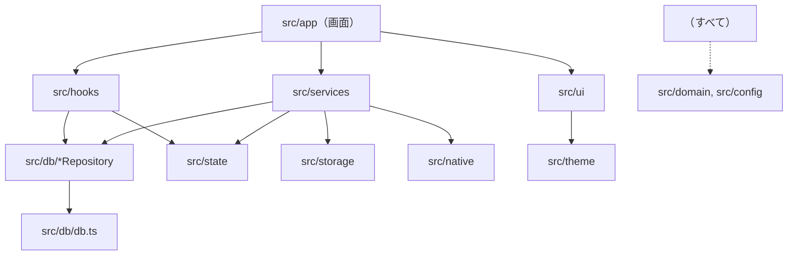

# Leaves 詳細設計書

| 項目 | 内容 |
|---|---|
| 文書名 | Leaves 詳細設計書 |
| 版数 | 2.1 |
| 作成日 | 2026-09-28 |
| 作成者 | SasaBranch |
| ステータス | 確定 |
| 入力文書 | [要件定義書 v1.2](../01_requirements/requirements.md) / [基本設計書 v1.1](../02_basic-design/basic-design.md) / [ADR](../adr/README.md) |

### 改訂履歴

| 版数 | 日付 | 内容 |
|---|---|---|
| 0.1 | 2026-09-28 | 初版作成 |
| 1.0 | 2026-09-28 | レビュー完了、確定 |
| 1.1 | 2026-09-28 | 画面の置き場所を `app/` から `src/app/` に変更（Expo SDK 57 のテンプレート構成に合わせる。#1） |
| 1.2 | 2026-09-28 | 4.3 Db 型を ADR 0011（順番待ち・tx 引数・SqlDriver）に合わせて更新（#7） |
| 1.3 | 2026-09-28 | 9.2 iOS の文字認識を Apple Vision に変更（ADR 0013） |
| 1.4 | 2026-09-28 | 8 章 画面用フックを実装に合わせて更新（M3） |
| 1.5 | 2026-09-28 | 12 章 テストデータ生成の扱いを実装に合わせて更新（#32） |
| 1.6 | 2026-09-28 | 9.6 整合性チェックを前回が途中で終わったときだけに変更（ADR 0015、#33） |
| 2.0 | 2026-09-28 | 本棚と、本棚フォルダを正本とする保存方式に対応（基本設計書 v1.1、ADR 0016〜0020）。2, 3.2〜3.3, 4, 5, 6.1〜6.2, 7〜12, 14 章。9.8〜9.11 を追加 |
| 2.1 | 2026-09-28 | 9.9 事前検証 R-6・R-7 の結果を反映（ADR 0021、#38） |

---

## 1. 本書の位置づけ

### 1.1 本書に書くこと・書かないこと
**コードそのものが最終的な設計書である**。自然言語の設計書は曖昧さを許してしまい、コードにした瞬間に初めて曖昧さが表に出る。そのため本書は、コードを書く前に決めておかないと手戻りが大きいもの、コードだけでは読み取りにくいものに絞る。

| 書くこと | 書かないこと |
|---|---|
| モジュールの責務と依存の向き | 各関数の実装手順（コードに書く） |
| 型（モジュール間の約束） | UI 部品の細かなスタイル（基本設計書 2 章とコードに書く） |
| DB の物理設計（DDL・トリガー・主要 SQL） | コードを読めば分かる処理の逐語的な説明 |
| 処理の流れのうち、順番に意味があるもの（整合性・状態遷移） | |
| 名前付き定数とその意味 | |
| 設計原則をこのプロジェクトでどう適用するか | |

### 1.2 設計判断の記録
設計判断は [ADR](../adr/README.md) に記録する。本書と ADR が食い違う場合は新しい ADR を優先する。本書の執筆にあたり、次の判断を ADR に記録した。

| ADR | 本書への影響 |
|---|---|
| [0004](../adr/0004-fulltext-search-trigram.md) 検索経路を1本にする | 基本設計書 5.3 の2方式切り替えを、trigram テーブルへの LIKE 1本に置き換え（6.4） |
| [0007](../adr/0007-notebook-ubiquitous-language.md) notebook に統一 | 基本設計書の `folders` / `folder_id` を `notebooks` / `notebook_id` に置き換え（2 章・6 章） |
| [0008](../adr/0008-db-access-wrapper-for-tests.md) DB ラッパー | リポジトリは `Db` 型を受け取る（4.3・10 章） |
| [0016](../adr/0016-shelf-folders-are-source-of-truth.md) 本棚フォルダが正本 | 変更は「フォルダ → DB」の順（9 章）。DB は作り直せる索引 |
| [0017](../adr/0017-leaves-json-identifies-folders.md) `.leaves.json` | 管理用ファイルの型と読み書き（5.2, 9.9） |
| [0018](../adr/0018-internal-data-outside-shelf.md) 内部データは `Documents/.leaves/` | 保存場所（4.5） |
| [0019](../adr/0019-fake-expo-file-system-on-node-fs.md) ファイル操作のテスト | expo-file-system を直接使い、テストでは node の fs で動く偽物に差し替える（12 章） |
| [0020](../adr/0020-sync-skips-unchanged-folders.md) 走査の省略 | フォルダの更新日時が前回の走査時と同じなら中身を読まない。アプリ自身の変更では記録を更新しない（9.9） |

---

## 2. 用語とコード上の名前

UI・仕様・コードで同じ言葉を使う（ADR 0007）。

| 概念 | UI 表示 | コード上の名前 | 補足 |
|---|---|---|---|
| ノートブック | ノートブック | `Notebook` / `notebooks` / `notebookId` | 要件定義書の「フォルダ」 |
| 本棚 | 本棚 | `Shelf` / `shelfId` | ノートブック・ノート一式の保存単位。`Documents` 直下の1フォルダ |
| 開いている本棚 | — | `OpenShelf` | 開いている本棚と、その DB・保存場所をまとめたもの（4.4） |
| ライブラリ | ライブラリ（見出しは本棚名） | `notebookId === null` | 本棚の最上位。レコードは持たない |
| ノート | ノート | `Note` / `notes` / `noteId` | 1枚以上のページを持つ |
| ページ | ページ | `Page` / `pages` / `pageId` | 画像1枚＋OCR 結果 |
| 取り込み画像 | — | `CapturedImage` | スキャン・写真選択で得た、保存前の一時画像 |
| ページ画像 | — | `pageImage` | 保存済みの原寸画像（長辺 2400px） |
| サムネイル | — | `thumbnail` | 一覧用の縮小画像（長辺 480px） |
| 文字認識 | 文字認識 | `ocr` | |
| 認識行 | — | `OcrLine` | OCR の1行分の文字と位置 |
| 書き出し | 書き出し | `export` | |
| 本棚フォルダ | — | `shelfDirectory` | 本棚の正本（ADR 0016） |
| 管理用ファイル | — | `manifest`（ファイル名 `.leaves.json`） | フォルダの種類・ID など（ADR 0017） |
| 外部変更の反映 | — | `syncShelf` | 本棚フォルダを走査して DB を合わせる（9.9） |
| 走査 | — | `scan` | 本棚フォルダを読み、今の状態を得ること |

### 命名規則
- **関数は動詞から始める**（`createNote`, `findNotesInNotebook`）。取得系は、1件なら `get`（なければ例外）/ `find`（なければ `null`）、複数なら `list` とする
- **真偽値は `is` / `has` / `can` で始める**（`isRoot`, `canMoveNotebook`）
- **副作用の範囲を名前で隠さない**。中身ごと消える削除は `deleteNotebookWithContents` とし、`deleteNotebook` のように一部しか消えないように見える名前にしない
- **略語は使わない**。例外は業界で定着している `id` `url` `ocr` `pdf` `uri` のみ
- ファイル名: 部品・画面は PascalCase（`NoteCover.tsx`）、それ以外は camelCase（`noteRepository.ts`）

---

## 3. 設計原則の適用方針

プログラミングの原理原則を、このプロジェクトで具体的にどう守るかを定める。原則同士は緊張関係にある（例: DRY と KISS、OCP と YAGNI）。共通する規律は **「まだ起きていない未来の予測に、今の複雑さを賭けない」** である。

### 3.1 KISS（絡み合わせない）
- 状態管理ライブラリ（Redux・Zustand 等）は使わない。画面のデータは SQLite から取得し、React の state に置く。データ変更の通知は 7 章の小さな仕組み1つで行う
- クラスは使わず、**関数とモジュール**で構成する（例外を表す `Error` の拡張と、ライブラリが要求する場合を除く）
- 意味のある数値はすべて名前付き定数にする（11 章）。マジックナンバーを書かない
- 1つの関数は1つのことをする。名前に「と」「And」が必要になったら分割のサイン

### 3.2 DRY（知識を1か所に）
「見た目が同じコード」ではなく **「同じ知識」** を1か所にまとめる。

| 知識 | 唯一の置き場所 |
|---|---|
| DB スキーマ | `src/db/migrations.ts`（追記のみ） |
| 画面の色・フォント | `src/theme/tokens.ts` |
| ファイルの保存場所（本棚フォルダの構成・内部データの場所・ページのファイル名） | `src/storage/paths.ts` |
| `.leaves.json` の形と読み書き | `src/storage/manifest.ts` |
| 名前の規則（使えない文字・重複時の連番） | `src/domain/name.ts` |
| 処理を1本の順番待ちに並べる方法 | `src/domain/serialQueue.ts`（DB と本棚のファイル操作の両方が使う） |
| ページ画像を保存する手順（リサイズ・サムネイル生成） | `src/storage/pageImages.ts` の `storePageImages`。新規ノート作成とページ追加の両方がこれを使う |
| OCR 状態の種類 | `src/domain/types.ts` の `OcrStatus` と DDL の CHECK 制約（6.2 で両者の一致をテストする） |
| エラー → 表示文言の対応 | `src/ui/errorMessages.ts` |
| 検索索引の同期 | DB トリガー（6.3）。アプリ側から `pages_fts` を直接更新しない |

一方で、**似ているが別の知識は共通化しない**（間違った抽象化は重複より悪い）。例:
- スキャン保存画面のページ一覧（SC-4）とページ並べ替え画面（SC-6）は見た目が似ているが、目的（保存前の確認／保存済みの編集）と変わる理由が違うため、別の部品にする
- 3回目の重複が現れるまでは共通化を待つ（Rule of Three）

### 3.3 YAGNI（必要になってから作る）
MVP で作らないもの:
- 同期のためのコード（変更履歴テーブル、競合解決など）。要件で決まっている UUID と `updated_at` の列だけは持つ（安価で、後から追加すると全データの移行が必要になるため）
- 汎用リポジトリ基底（`Repository<T>` など）、DI コンテナ、プラグイン機構
- タグ、ゴミ箱の列やテーブル
- フォルダの変更の常時監視（`Directory.watch`）。反映は起動時と前面復帰時で足りる（FR-X-04）
- 使われない引数・オプション

抽象化を入れてよいのは、**今すでに2つ以上の実装が必要な場合**だけとする。本書で入れた抽象化は次の2つのみ。

| 抽象化 | 今ある2つの実装 |
|---|---|
| `Db` 型（ADR 0008） | expo-sqlite（アプリ）/ better-sqlite3（テスト） |
| ネイティブアダプタ（`src/native/`） | 実ライブラリ（アプリ）/ Jest のモック（テスト） |

### 3.4 OCP（拡張に開き、修正に閉じる）
最初から拡張点を用意しない。分岐が増えて3つ目のバリエーションが来たときに、実際のコードから抽象の形を見つけて移行する。
- 書き出し形式は、MVP の時点で PDF・Markdown・画像の3つがある。共通の手順（ファイルを作る → 共有シートを開く → 一時ファイルを消す）を `shareExport` に、形式ごとの違い（ファイルの作り方）を形式ごとの関数に分ける（9.5）。形式を追加するときは、関数を1つ追加して対応表に1行足すだけで済む

### 3.5 SLAP（抽象度を揃える）
- サービス層の公開関数は、**処理の段落を並べた「目次」** として書く。各段落の中身（ループ・条件分岐の塊）は名前付きの関数に切り出す（9.1 の例）
- 画面コンポーネントは「データ取得フック＋表示部品の組み立て」だけを書き、SQL・ファイル操作を直接書かない
- 1行で意図が表せる処理（代入、単一の API 呼び出し）は無理に関数にしない

### 3.6 PIE・名前重要（意図を表現する）
- 2 章の用語と命名規則に従う
- コメントは「なぜ」を書く（何をしているかは名前で表す）。「何をしているか」のコメントを書きたくなったら、そのコメントを名前にして関数に切り出す
- 型で意図を表す。例: ID は `NotebookId` `NoteId` `PageId` と別々の型にし、取り違えをコンパイル時に防ぐ

### 3.7 コードは必ず変更される
- 設計判断は ADR に残す（1.2）
- DB スキーマの変更は、既存のマイグレーションを書き換えず、新しいマイグレーションを追加する
- 変更が起きやすい部分（UI、書き出し形式）と起きにくい部分（DB の整合性、ファイル保存）を別モジュールに分け、変更の影響を閉じ込める

---

## 4. モジュール構成

### 4.1 ディレクトリとファイルの責務

```
src/
├── app/                           … 画面（expo-router）。表示と操作の受け付けのみ
│   ├── _layout.tsx                … フォント読み込み、テーマ、DB 初期化、起動時処理の開始
│   ├── index.tsx                  … SC-1 ライブラリ
│   ├── notebook/[id].tsx          … SC-2 ノートブック
│   ├── note/[id].tsx              … SC-5 ノート表示
│   ├── note/[id]/reorder.tsx      … SC-6 ページ並べ替え
│   ├── capture.tsx                … SC-4 スキャン保存
│   ├── search.tsx                 … SC-7 検索
│   ├── move.tsx                   … SC-8 移動先選択
│   └── settings.tsx               … SC-10 設定（SC-9 は ui/components/WelcomeScreen.tsx）
├── domain/
│   ├── types.ts                   … 型定義（5 章）
│   ├── name.ts                    … 名前の規則（9.11）
│   └── serialQueue.ts             … 順番待ち（DB・本棚のファイル操作で共通）
├── config.ts                      … 名前付き定数（11 章）
├── db/
│   ├── db.ts                      … Db 型・SqlDriver 型・createDb
│   ├── expoSqliteDriver.ts        … アプリ用 SqlDriver（expo-sqlite）
│   ├── migrations.ts              … スキーマ（追記のみ）
│   ├── openShelfDatabase.ts       … 本棚の DB を開く（旧 openAppDatabase）
│   ├── openLegacyDatabase.ts      … v1.0 の DB を開く（移行用）
│   ├── indexRepository.ts         … 外部変更の反映のための一括の読み書き
│   ├── notebookRepository.ts
│   ├── noteRepository.ts
│   ├── pageRepository.ts
│   └── searchRepository.ts
├── storage/
│   ├── paths.ts                   … 保存場所の組み立て（4.5）
│   ├── manifest.ts                … .leaves.json の読み書き
│   ├── appSettings.ts             … 最後に開いた本棚
│   └── pageImages.ts              … ページ画像の変換・保存・サムネイル
├── native/                        … 外部ライブラリの薄い包み
│   ├── scanner.ts
│   ├── imagePicker.ts
│   ├── textRecognizer.ts
│   └── share.ts
├── services/
│   ├── capture.ts                 … ノート作成・ページ追加
│   ├── notebooks.ts               … ノートブックの作成・移動・削除
│   ├── notes.ts                   … ノートの移動・削除、ページの並べ替え・削除
│   ├── ocrQueue.ts                … OCR キュー（開いている本棚のみ）
│   ├── shelves.ts                 … 本棚の一覧・作成・名前変更・削除・開く・閉じる（9.8）
│   ├── folders.ts                 … DB の親子・名前から本棚フォルダ内の場所を求める
│   ├── sync/                      … 外部変更の反映（9.9）
│   │   ├── syncShelf.ts           … 目次（走査 → 正規化 → DB に反映）
│   │   ├── scanShelf.ts           … 本棚フォルダを読む
│   │   ├── normalizeNoteFolder.ts … ページの対応づけと番号の付け直し
│   │   └── diffIndex.ts           … 走査結果と DB の差分（純粋関数）
│   ├── legacyMigration.ts         … v1.0 のデータの移行（9.10）
│   ├── startup.ts                 … 起動時処理（旧 integrity.ts。9.6）
│   └── export/
│       ├── shareExport.ts         … 書き出しの共通手順と形式の対応表
│       ├── pdf.ts
│       ├── markdown.ts
│       └── pageImage.ts
├── state/
│   ├── dataChanges.ts             … データ変更の通知（7 章）
│   └── openShelf.tsx              … 開いている本棚の Context（旧 database.tsx）
├── hooks/                         … 画面用のデータ取得（8 章）
├── ui/
│   ├── components/                … NoteCover, NotebookCover, ActionBar, OcrStatusChip …
│   └── errorMessages.ts
└── theme/
    ├── tokens.ts                  … 色・フォント（基本設計書 2.2〜2.3）
    └── useTheme.ts                … OS 設定に応じたトークンの選択

assets/fonts/                      … Fraunces, ZenKakuGothicNew, NotoSansJP（PDF 用）
test/                              … テスト用の Db 実装、node の fs で動く expo-file-system の偽物（ADR 0019）、テスト用の本棚
```

### 4.2 依存の向き



- 矢印の逆向きの依存は禁止（例: リポジトリから services を呼ばない）
- **画面が DB を更新するときは必ず services を通す**。読み取りは hooks からリポジトリを直接呼んでよい（読み取りのためだけに services を挟むのは、中身のない中継関数を増やすだけのため）
- `src/native` と `src/storage` は互いに依存しない

### 4.3 Db 型（ADR 0008 / 0011）

```ts
export type SqlValue = string | number | null;

// リポジトリが使う DB 操作
export type Db = {
  run(sql: string, params?: SqlValue[]): Promise<void>;
  get<T>(sql: string, params?: SqlValue[]): Promise<T | null>;
  all<T>(sql: string, params?: SqlValue[]): Promise<T[]>;
  transaction(work: (tx: Db) => Promise<void>): Promise<void>; // 中の操作は tx で行う
};

// SQLite ライブラリごとの差を吸収する口
export type SqlDriver = {
  run(sql: string, params: SqlValue[]): Promise<void>;
  get<T>(sql: string, params: SqlValue[]): Promise<T | null>;
  all<T>(sql: string, params: SqlValue[]): Promise<T[]>;
};

export function createDb(driver: SqlDriver): Db;
```

- `createDb` は、すべての操作を1本の順番待ちに並べ、トランザクションを `BEGIN IMMEDIATE` / `COMMIT` / `ROLLBACK` で行う（ADR 0011）。アプリとテストで共通
- `SqlDriver` の実装はアプリ用 `src/db/expoSqliteDriver.ts`（expo-sqlite）とテスト用 `test/testDb.ts`（better-sqlite3）の2つ
- `Db` は4関数、`SqlDriver` は3関数から広げない

### 4.4 開いている本棚（OpenShelf）

```ts
export type OpenShelf = {
  id: ShelfId;
  name: string;
  directory: Directory;        // Documents/{本棚名}/（正本）
  internalDirectory: Directory; // Documents/.leaves/shelves/{shelfId}/（索引 DB・サムネイル）
  db: Db;
  /** 本棚フォルダを書き換える処理を1本に並べる（走査中にアプリの変更が割り込まないように。基本設計書 6.7） */
  runExclusively<T>(task: () => Promise<T>): Promise<T>;
};
```

- 本棚フォルダを書き換える services は、`db` ではなく `OpenShelf` を受け取る。DB を読むだけのリポジトリ・フックは従来どおり `Db` を受け取る
- 画面へは `ShelfProvider`（`state/openShelf.tsx`）で渡す。`useShelf()` で取得し、`useDb()` は `useShelf().db` を返す
- 本棚を切り替えたら、画面の木を `key={shelf.id}` で作り直す（前の本棚のデータを持った画面・フックを残さないため）

### 4.5 保存場所（`storage/paths.ts`）
基本設計書 5.4 の構成を関数で表す。パスはこの関数からだけ組み立てる。

| 関数 | 返す場所 |
|---|---|
| `shelvesRootDirectory()` | `Documents/`（本棚の親。「ファイル」アプリの Leaves） |
| `appInternalDirectory()` | `Documents/.leaves/` |
| `shelfInternalDirectory(shelfId)` | `Documents/.leaves/shelves/{shelfId}/` |
| `workDirectory()` | `Documents/.leaves/work/`（組み立て中のノート。起動時に空にする）。本棚と同じボリュームに置き、完成したノートを移動（名前の付け替え）だけで置けるようにする |
| `notebookDirectory(shelf, notebookPath)` | 本棚フォルダ ＋ 祖先から順のノートブック名 |
| `noteDirectory(shelf, notebookPath, title)` | 上 ＋ ノート名 |
| `pageFileName(position)` | `001.jpg` …（`position` は 0 始まり、名前は 1 始まり、`PAGE_FILE_NUMBER_DIGITS` 桁のゼロ埋め。1000 ページ目以降は桁が増える） |
| `thumbnailFile(shelf, pageId)` | `shelfInternalDirectory/thumbs/{pageId}.jpg` |
| `manifestFile(directory)` | `directory/.leaves.json` |

- ページ画像の場所は ID だけでは決まらない（ノートの場所・名前と、ページの順番で決まる）。画面は `useNote` が返す `noteDirectory` と `page.position` から組み立てる
- 名前が `.` で始まるものは、アプリの管理用とみなして走査・一覧の対象から外す（`isHiddenEntryName`）

---

## 5. 型定義

### 5.1 ドメインの型

`src/domain/types.ts` に置く。モジュール間の約束はこの型で表す。

```ts
// 取り違えを防ぐため、ID ごとに別の型にする
type Brand<T, Name> = T & { readonly __brand: Name };
export type NotebookId = Brand<string, 'NotebookId'>;
export type NoteId = Brand<string, 'NoteId'>;
export type PageId = Brand<string, 'PageId'>;

export type ShelfId = Brand<string, 'ShelfId'>;

export type IsoDateTime = string; // ISO 8601（UTC）

export type Shelf = { id: ShelfId; name: string };

export type Notebook = {
  id: NotebookId;
  parentId: NotebookId | null; // null はライブラリ直下
  name: string;
  color: NotebookColor;
  createdAt: IsoDateTime;
  updatedAt: IsoDateTime;
};

export type Note = {
  id: NoteId;
  notebookId: NotebookId | null;
  title: string;
  createdAt: IsoDateTime;
  updatedAt: IsoDateTime;
};

export const OCR_STATUSES = ['pending', 'processing', 'done', 'failed'] as const;
export type OcrStatus = (typeof OCR_STATUSES)[number];

// 画像に対する相対座標（0〜1）。画像サイズが変わっても使えるようにするため
export type OcrLine = { text: string; x: number; y: number; width: number; height: number };

export type Page = {
  id: PageId;
  noteId: NoteId;
  position: number; // ノート内の順番（0 始まり）
  width: number;    // 画像の幅（px）
  height: number;
  ocrStatus: OcrStatus;
  ocrText: string;
  ocrLines: OcrLine[];
  createdAt: IsoDateTime;
  updatedAt: IsoDateTime;
};

// 一覧表示用（ノート表紙に必要な情報をまとめて1回の SQL で取る）
export type NoteSummary = Note & { pageCount: number; coverPageId: PageId };
export type NotebookSummary = Notebook & { noteCount: number };

export type CapturedImage = { uri: string; width: number; height: number };

export type SearchHit = {
  noteId: NoteId;
  noteTitle: string;
  pageId: PageId;
  pagePosition: number;
  notebookPath: string[]; // 例: ['大学', '線形代数']
  snippet: { before: string; match: string; after: string };
};

export type SortOrder = 'updatedAt' | 'name';
```

`NotebookColor` は 11 章の `NOTEBOOK_COLORS` の要素の型とする。

### 5.2 管理用ファイルの型（`storage/manifest.ts`、ADR 0017）

```ts
export const MANIFEST_VERSION = 1;

export type ShelfManifest = { kind: 'shelf'; version: 1; id: ShelfId; createdAt: IsoDateTime };
export type NotebookManifest = {
  kind: 'notebook'; version: 1; id: NotebookId; color: NotebookColor;
  createdAt: IsoDateTime; updatedAt: IsoDateTime;
};
export type NoteManifest = {
  kind: 'note'; version: 1; id: NoteId; createdAt: IsoDateTime; updatedAt: IsoDateTime;
  pages: PageManifest[]; // ページ順
};
export type PageManifest = {
  id: PageId;
  file: string;          // 001.jpg など
  size: number;          // バイト数（外部で名前を変えられたときの対応づけに使う）
  modifiedAt: number;    // ファイルの更新日時（ミリ秒）。同上
  width: number; height: number;
  ocrStatus: 'pending' | 'done' | 'failed'; // processing は DB の中だけの一時的な状態
  ocrText: string; ocrLines: OcrLine[];
  createdAt: IsoDateTime;
};
export type Manifest = ShelfManifest | NotebookManifest | NoteManifest;

export function readManifest(directory: Directory): Manifest | null; // ない・壊れている・知らない version は null
export function writeManifest(directory: Directory, manifest: Manifest): void; // 一時ファイルに書いてから置き換える
```

- 読み込み時に形を検査し、合わないものは「管理用ファイルがない」とみなす（外部で壊されても異常終了しない。NFR-R-04）
- `version` は将来の形の変更に備える。今は 1 だけを受け付ける

---

## 6. データベース物理設計

### 6.1 接続設定
本棚ごとに `Documents/.leaves/shelves/{shelfId}/index.db` を開く（`openDatabaseAsync(name, undefined, directory)`。ADR 0018）。開けない・壊れている場合はファイルを消して作り直し、全体を走査して中身を復元する（9.9）。
DB を開いた直後に毎回実行する。

```sql
PRAGMA foreign_keys = ON;    -- CASCADE 削除を有効にするため（SQLite は既定で無効）
PRAGMA journal_mode = WAL;   -- 書き込み中も読み取りを止めないため
```

### 6.2 テーブル（マイグレーション 1）

```sql
CREATE TABLE notebooks (
  id          TEXT PRIMARY KEY,
  parent_id   TEXT REFERENCES notebooks(id) ON DELETE CASCADE,
  name        TEXT NOT NULL CHECK (length(trim(name)) > 0),
  color       TEXT NOT NULL,
  created_at  TEXT NOT NULL,
  updated_at  TEXT NOT NULL
);
-- 同じ場所に同名のノートブックを作れない（FR-F-06）。
-- parent_id が NULL 同士は UNIQUE で区別されないため、空文字に置き換えて比較する
CREATE UNIQUE INDEX notebooks_unique_name ON notebooks (ifnull(parent_id, ''), name);

CREATE TABLE notes (
  id           TEXT PRIMARY KEY,
  notebook_id  TEXT REFERENCES notebooks(id) ON DELETE CASCADE,
  title        TEXT NOT NULL,
  created_at   TEXT NOT NULL,
  updated_at   TEXT NOT NULL
);
CREATE INDEX notes_by_notebook ON notes (notebook_id, updated_at DESC);

CREATE TABLE pages (
  id          TEXT PRIMARY KEY,
  note_id     TEXT NOT NULL REFERENCES notes(id) ON DELETE CASCADE,
  position    INTEGER NOT NULL,
  width       INTEGER NOT NULL,
  height      INTEGER NOT NULL,
  ocr_status  TEXT NOT NULL DEFAULT 'pending'
              CHECK (ocr_status IN ('pending', 'processing', 'done', 'failed')),
  ocr_text    TEXT NOT NULL DEFAULT '',
  ocr_lines   TEXT NOT NULL DEFAULT '[]',  -- OcrLine[] の JSON
  created_at  TEXT NOT NULL,
  updated_at  TEXT NOT NULL,
  UNIQUE (note_id, position)
);
CREATE INDEX pages_by_ocr_status ON pages (ocr_status);

CREATE VIRTUAL TABLE pages_fts USING fts5 (
  page_id UNINDEXED,
  title,
  ocr_text,
  tokenize = 'trigram'
);
```

- マイグレーションは `PRAGMA user_version` を見て、未適用のものを順番に1トランザクションずつ適用する

**マイグレーション 2（本棚フォルダを正本にする。v2.0）**

```sql
-- 名前の重複はフォルダ（ファイルシステム）が防ぐ。外部で付けられた名前（大文字・小文字違いなど）を
-- 走査で取り込めなくなるのを避けるため、DB の一意制約は外す（ADR 0016）
DROP INDEX notebooks_unique_name;

-- 前回の走査時のフォルダの更新日時（ミリ秒）。同じなら中身の確認を省く（ADR 0020）。NULL は未走査
ALTER TABLE notebooks ADD COLUMN scanned_modified_at REAL;
ALTER TABLE notes     ADD COLUMN scanned_modified_at REAL;
```

- DB は本棚ごとに新しく作るため、v1.0 の DB にマイグレーション 2 を当てることはない（v1.0 のデータは 9.10 で移す）。それでもスキーマの変更は追記の約束（3.7）どおりマイグレーションとして書く- `ocr_status` の CHECK 制約と `OCR_STATUSES` が一致していることをテストで確認する（知識の二重化をテストで縛る）

### 6.3 検索索引の同期（トリガー）
`pages_fts` はトリガーだけが更新する。アプリのコードから直接書き込まない（DRY: 同期の知識を DB に1か所）。

```sql
CREATE TRIGGER pages_fts_after_page_insert AFTER INSERT ON pages BEGIN
  INSERT INTO pages_fts (page_id, title, ocr_text)
  SELECT new.id, notes.title, new.ocr_text FROM notes WHERE notes.id = new.note_id;
END;

CREATE TRIGGER pages_fts_after_ocr_update AFTER UPDATE OF ocr_text ON pages BEGIN
  UPDATE pages_fts SET ocr_text = new.ocr_text WHERE page_id = new.id;
END;

CREATE TRIGGER pages_fts_after_page_delete AFTER DELETE ON pages BEGIN
  DELETE FROM pages_fts WHERE page_id = old.id;
END;

CREATE TRIGGER pages_fts_after_title_update AFTER UPDATE OF title ON notes BEGIN
  UPDATE pages_fts SET title = new.title
  WHERE page_id IN (SELECT id FROM pages WHERE note_id = new.id);
END;
```

CASCADE で削除されたページでも `AFTER DELETE ON pages` トリガーは実行される（`foreign_keys = ON` の場合）。これをテストで確認する。

### 6.4 主要な SQL

**ノートブックの子孫（移動の検証・範囲検索・削除件数に共通）**

```sql
WITH RECURSIVE subtree(id) AS (
  SELECT :notebookId
  UNION ALL
  SELECT notebooks.id FROM notebooks JOIN subtree ON notebooks.parent_id = subtree.id
)
SELECT id FROM subtree;
```

**ノートブック内のノート一覧（表紙情報つき）**

```sql
SELECT notes.*,
       count(pages.id) AS page_count,
       (SELECT id FROM pages p WHERE p.note_id = notes.id ORDER BY position LIMIT 1) AS cover_page_id
FROM notes
LEFT JOIN pages ON pages.note_id = notes.id
WHERE notes.notebook_id IS :notebookId      -- IS を使うことで NULL（ライブラリ直下）にも一致させる
GROUP BY notes.id
ORDER BY notes.updated_at DESC;             -- 名前順のときは notes.title COLLATE NOCASE
```

**検索（ADR 0004: 経路は1本）**

```sql
SELECT pages_fts.page_id, pages_fts.title, pages_fts.ocr_text,
       pages.position, notes.id AS note_id, notes.notebook_id
FROM pages_fts
JOIN pages ON pages.id = pages_fts.page_id
JOIN notes ON notes.id = pages.note_id
WHERE (pages_fts.title LIKE :pattern ESCAPE '\' OR pages_fts.ocr_text LIKE :pattern ESCAPE '\')
  AND (:scopeAll = 1 OR notes.notebook_id IN (/* 子孫 CTE */))
ORDER BY notes.updated_at DESC, pages.position
LIMIT :limit;
```

- `:pattern` は `%` + キーワード（`\` `%` `_` をエスケープ）+ `%`
- タイトルだけが一致したノートは複数ページが該当するため、アプリ側でノートごとに最初のページだけ残す
- 所属パス（`notebookPath`）はノートブック全件（数百件程度）をメモリに読み、ID から親をたどって組み立てる。SQL の再帰で1件ずつ求めるより単純で、件数的にも問題ない

### 6.5 ページの並べ替え
`UNIQUE (note_id, position)` があるため、位置を1件ずつ書き換えると途中で重複が起きる。1トランザクション内で、いったん全ページの位置を負の値に退避してから、新しい順番を書き込む。

```sql
UPDATE pages SET position = -(position + 1) WHERE note_id = :noteId;
-- 新しい順番で1件ずつ
UPDATE pages SET position = :newPosition, updated_at = :now WHERE id = :pageId;
```

---

## 7. データ変更の通知

画面間でデータの更新を反映する仕組み。`src/state/dataChanges.ts` に置く。

```ts
export function notifyDataChanged(): void;
export function subscribeDataChanged(listener: () => void): () => void; // 戻り値は購読解除
```

- services は DB を更新するトランザクションが **コミットされた後** に `notifyDataChanged()` を1回呼ぶ。外部変更の反映（9.9）も、DB に差分があったときに1回呼ぶ
- 本棚の切り替えは通知ではなく、画面の木の作り直しで反映する（4.4）
- hooks は購読し、通知を受けたら自分のクエリを取り直す
- 通知は「何かが変わった」の1種類だけとする。どの画面も SQLite から数十〜百件程度を読み直すだけで十分速いため、変更の種類ごとの細かい通知は作らない（KISS・YAGNI）。性能問題が実測で出たら細分化する

---

## 8. 画面用フック

`src/hooks/` に置く。画面はこれらと services だけを使う。

| フック | 返す値 | 使う画面 |
|---|---|---|
| `useLibrary(sort)` | `{ recentNotes, notebooks, notes }` | SC-1 |
| `useNotebook(id, sort)` | `{ notebook, parentName, childNotebooks, notes, pageCount }` | SC-2 |
| `useNote(id)` | `{ note, pages, notebookPath, noteDirectory }`（ページ画像の場所の組み立て用） | SC-5, SC-6 |
| `useSearch(keyword, scope)` / `useSearchScopes(scope)` | `{ hits, searchedKeyword, isSearching }` / 範囲チップ用のノートブック | SC-7 |
| `useNotebookTree(movingNotebookId)` | `{ roots, unselectableIds }`（移動対象とその子孫は選べない） | SC-8 |
| `useCaptureLauncher(target)` | `{ scan, importPhotos }`（新しいノートを作る／既存ノートにページを足す） | SC-1, SC-2, SC-5 |
| `useItemMenus()` | 長押しメニュー・名前入力ダイアログを開く関数と、その描画要素 | SC-1, SC-2 |
| `useShelf()` / `useDb()` | 開いている本棚 / その DB | すべて |
| `useShelves()` | 本棚の一覧（`Documents` 直下の走査。設定画面を開いたときと、本棚の操作の後に取り直す） | SC-10 |
| `useSyncOnForeground(shelf)` | なし（起動時と、アプリが前面に戻ったときに `syncShelf` を呼ぶ） | ルートレイアウト |

- すべてのフックは `subscribeDataChanged` を購読し、変更時に取り直す
- 取得中は前回の値を表示し続ける（画面のちらつきを防ぐため）

---

## 9. 主要処理の詳細

### 9.1 ノート作成・ページ追加（`services/capture.ts`）

```ts
export async function createNoteFromCapture(input: {
  images: CapturedImage[];
  title: string;
  notebookId: NotebookId | null;
}): Promise<NoteId>;

export async function addPagesToNote(noteId: NoteId, images: CapturedImage[]): Promise<void>;
```

第1引数は `OpenShelf`。公開関数は処理の段落を並べるだけにする（SLAP）。本棚フォルダを書く部分は `shelf.runExclusively` の中で行う。

```ts
export async function createNoteFromCapture(shelf, input) {
  const note = await shelf.runExclusively(async () => {
    const work = await buildNoteInWorkDirectory(shelf, input.images); // 作業用フォルダに画像・サムネイル・.leaves.json
    const title = pickAvailableName(listNamesIn(parentDirectory), input.title); // 重複時は (2)…
    work.directory.move(noteDirectory(shelf, notebookPath, title));   // 1回の移動で本棚に置く
    await insertNoteWithPages(shelf.db, work.manifest, title, input.notebookId); // DB は1トランザクション
    return work.manifest;
  });
  discardCapturedImages(input.images);
  notifyDataChanged();
  enqueueOcr(note.pages.map((page) => page.id));
  return note.id;
}
```

- `storePageImages(images, directory, firstPosition)`（`storage/pageImages.ts`）: 各画像について ID を採番し、長辺 2400px・JPEG 0.8 で `directory/{pageFileName}`、長辺 480px・JPEG 0.7 でサムネイルを書き出して `PageManifest[]` を返す（サイズ・更新日時は書いた後のファイルから読む）。途中で失敗したら、それまでに書いたファイルを消してから例外を投げる
- `addPagesToNote` はノートのフォルダに直接、末尾の番号に続けて書き、`.leaves.json` を書き換えてから DB に登録する。ノートの `updated_at` を更新する
- 作業用フォルダは失敗時に消す。消せなかった残骸は起動時に `workDirectory` ごと消す
- **本棚に置いた後、DB 登録で失敗・終了した場合**は、フォルダを消さない。次回の反映（9.9）で DB に登録される（フォルダが正本のため）
- v1.0 の `withImageOperation`（ADR 0015）はなくす

### 9.2 OCR キュー（`services/ocrQueue.ts`）

```ts
export function startOcrQueue(): Promise<void>; // 起動時: processing → pending に戻し、pending を全件投入
export function enqueueOcr(pageIds: PageId[]): void;
export function retryOcr(pageId: PageId): Promise<void>; // failed → pending にして投入
```

- モジュール内に「待ち行列」と「処理中かどうか」だけを持ち、1件ずつ順番に処理する
- `startOcrQueue(shelf)` / `stopOcrQueue()`: 本棚を開いたとき・閉じる前に呼ぶ。止めるときは待ち行列を空にし、認識中の1件は結果を捨てる（閉じた本棚の DB に書かないため）
- 1件の処理: `processing` に更新 → ページ画像の場所を DB（ノートの場所・名前・ページ順）から組み立てる → `recognizeText` → 行の座標を画像サイズで割って相対座標にする → `shelf.runExclusively` の中で **ノートの `.leaves.json` → DB** の順に結果を保存する。例外時は `failed` を同じ順で保存する
- ノートの `.leaves.json` に該当ページがない（認識中に外部で消された）場合は、結果を捨てて次へ進む
- 状態を更新するたびに `notifyDataChanged()` を呼ぶ
- 認識中にページが削除された場合（結果の保存先がない）は、結果を捨てて次へ進む

`native/textRecognizer.ts`:

```ts
export type RecognizedLine = { text: string; frame: { left: number; top: number; width: number; height: number } }; // px
export function recognizeText(imageUri: string): Promise<{ text: string; lines: RecognizedLine[] }>;
```

iOS は Apple Vision（`modules/vision-text-recognizer`）、Android は ML Kit の日本語認識器（`TextRecognitionScript.JAPANESE`）を使う（ADR 0013）。どちらも行ごとの文字と位置（左上原点の px）で返す。

### 9.3 ノートブックの操作（`services/notebooks.ts`）

```ts
export async function createNotebook(name: string, parentId: NotebookId | null): Promise<NotebookId>;
export async function renameNotebook(id: NotebookId, name: string): Promise<void>;
export async function changeNotebookColor(id: NotebookId, color: NotebookColor): Promise<void>;
export async function moveNotebook(id: NotebookId, newParentId: NotebookId | null): Promise<void>;
export async function countNotebookContents(id: NotebookId): Promise<{ notebooks: number; notes: number }>;
export async function deleteNotebookWithContents(id: NotebookId): Promise<void>;
```

- 第1引数は `OpenShelf`。**フォルダを先に変更し、成功したら DB に反映する**（基本設計書 6.3）。フォルダの変更に失敗したら DB は変えない
- 名前は `validateName`（9.11）で検査する。同じ場所の重複は、`shelf.runExclusively` の中で親フォルダの一覧（大文字・小文字を区別しない）と比べて判定し、`duplicateName` にする（DB の一意制約はマイグレーション 2 で外したため、判定の根拠はフォルダ）
- 作成: フォルダを作り、`.leaves.json`（kind: notebook）を書いてから DB に登録する
- 表紙色の変更: `.leaves.json` を書き換えてから DB を更新する
- 表紙色は、同じ親の下のノートブック数を `NOTEBOOK_COLORS` の数で割った余りで選ぶ（順番に割り当て）
- `moveNotebook`: 移動先が「自分自身または子孫」なら `InvalidMoveError`（子孫 CTE で判定）
- `moveNotebook`: 上記に加え、移動先に同じ名前があれば `duplicateName`
- `deleteNotebookWithContents`: 子孫のページ ID を先に集める（サムネイル削除用）→ フォルダを中身ごと削除 → DB から削除（CASCADE）→ サムネイルを削除

### 9.4 ノート・ページの操作（`services/notes.ts`）

```ts
export async function renameNote(id: NoteId, title: string): Promise<void>;
export async function moveNote(id: NoteId, notebookId: NotebookId | null): Promise<void>;
export async function deleteNote(id: NoteId): Promise<void>;
export async function reorderPages(noteId: NoteId, orderedPageIds: PageId[]): Promise<void>;
export async function deletePage(pageId: PageId): Promise<{ noteDeleted: boolean }>;
```

- 第1引数は `OpenShelf`。9.3 と同じく、フォルダ → DB の順で変更する。名前変更・移動はノートのフォルダの名前変更・移動、削除はフォルダの削除（とサムネイルの削除）
- `reorderPages`: 渡された ID の集合が、そのノートの全ページと一致しない場合は例外（呼び出し側の誤りを早く検出する）。画像を新しい順番のファイル名に付け直し（`renumberPageFiles`）、`.leaves.json` を書き換えてから、6.5 の SQL で DB を更新する
- `deletePage`: 最後の1ページなら、ノートごと削除して `noteDeleted: true` を返す。確認ダイアログは画面側が事前に出す（FR-N-08）。それ以外は画像を消して残りを付け直し（`renumberPageFiles`）、`.leaves.json` → DB の順に反映する
- `renumberPageFiles(noteDirectory, files)`（`storage/pageImages.ts`）: 名前の衝突を避けるため、いったん全ファイルを仮の名前（`.renumber-{n}`、ドットで始まるため途中で走査されても無視される）にしてから `001.jpg` …に付け直す。外部変更の反映（9.9）もこれを使う

### 9.5 書き出し（`services/export/`）

```ts
export type ExportFormat = 'pdf' | 'markdown' | 'pageImage';

// 形式ごとの違いは「どのファイルを作るか」だけ
type BuildExportFile = (noteId: NoteId, options: { pageId?: PageId }) => Promise<{ uri: string; mimeType: string }>;

const exportBuilders: Record<ExportFormat, BuildExportFile> = {
  pdf: buildPdf,
  markdown: buildMarkdownZip,
  pageImage: copyPageImage,
};

export async function shareExport(format: ExportFormat, noteId: NoteId, options = {}): Promise<void> {
  const file = await exportBuilders[format](noteId, options);
  try {
    await shareFile(file);
  } finally {
    await deleteExportFile(file.uri);
  }
}
```

**PDF（`pdf.ts`、ADR 0006）**
1. 各ページについて、PDF ページの幅を A4 幅（`PDF_PAGE_WIDTH_PT` = 595.28pt）とし、高さは画像の縦横比から求める
2. ページ画像（JPEG）をそのまま埋め込み、ページ全面に描画する
3. `ocrLines` の各行を不可視テキストで重ねる。行の相対座標 `(x, y, width, height)` から
   - 左下原点に変換: `pdfX = x × W`, `pdfY = H − (y + height) × H`
   - 文字サイズ: `fontSize = height × H × OCR_TEXT_HEIGHT_RATIO`（行の高さより少し小さくする）
   - 横幅合わせ: 行の実際の幅 `width × W` と、そのフォントサイズで描いたときの幅の比を水平拡大率（PDF の `Tz`）に設定する
   - 描画モードを不可視（`Tr 3`）にする
   pdf-lib の高水準 API はこの2つ（`Tz`, `Tr`）を扱えないため、低水準の演算子（`setTextRenderingMode`, `setCharacterSqueeze` 等）で書く
4. フォントは同梱の Noto Sans JP を `subset: true` で埋め込み、使った文字だけを含める

**Markdown（`markdown.ts`）**: 基本設計書 6.4 の形式。画像は `images/p01.jpg` のように2桁ゼロ埋めの連番とする。

**ファイル名**: `sanitizeFileName(title)` で `/ \ : * ? " < > |` を `_` に置き換え、前後の空白と末尾のピリオドを除く。空になったら `Leaves` とする。

### 9.6 起動時処理（`src/app/_layout.tsx` → `services/startup.ts`）

```ts
// 画面表示に必要なもの（ここまで終わるまでスプラッシュを表示）
await loadFonts();
await migrateLegacyDataIfPresent();      // v1.0 のデータがあれば本棚に移す（9.10。初回のみ）
const shelf = await openLastShelf();     // settings.json の本棚、なければ一覧の先頭。本棚がなければ null → SC-9
// 画面表示後に裏で行うもの（NFR-P-01）
void runShelfMaintenance(shelf);         // 作業用・書き出し用の一時フォルダを空に → 反映（9.9） → OCR キュー開始
```

- 本棚がないときは、ルートレイアウトが SC-9 を表示する。SC-9 は戻る先のない「入口」であり、URL で開く画面ではないため、**ルートではなく部品（`ui/components/WelcomeScreen.tsx`）として描画する**（基本設計書 4.1 のルート `/welcome` は設けない）
- 前面に戻ったとき（`AppState` が `active` になったとき）も `syncShelf` を呼ぶ。反映中に再び呼ばれた場合は、終わってからもう1回だけ行う（連続して呼ばれても走査は最大2回）
- 内部データ（`.leaves/shelves/`）のうち、どの本棚の `.leaves.json` にも対応しないもの（外部で本棚が削除された）は、本棚の一覧を取ったときに削除する

### 9.7 既定のタイトル
`formatDefaultTitle(date)` → `YYYY-MM-DD HH.mm`（端末のタイムゾーン。`:` はファイル名に使えないため。FR-S-07）。DB の日時は UTC で保存し、表示時に端末のタイムゾーンに変換する。

### 9.8 本棚の操作（`services/shelves.ts`）

```ts
export function listShelves(): Shelf[];                     // Documents 直下の、. で始まらないフォルダ。名前順
export async function createShelf(name: string): Promise<Shelf>;
export async function renameShelf(id: ShelfId, name: string): Promise<void>;
export async function deleteShelfWithContents(id: ShelfId): Promise<void>;
export async function countShelfContents(id: ShelfId): Promise<{ notebooks: number; notes: number }>;
export async function openShelf(id: ShelfId): Promise<OpenShelf>;  // DB を開き、settings.json に記録
export async function closeShelf(shelf: OpenShelf): Promise<void>; // OCR キューを止めて DB を閉じる
```

- `listShelves`: `.leaves.json` のないフォルダ（外部で作られた）には、その場で kind: shelf の `.leaves.json` を書いて ID を振る（FR-X-09）
- 名前の検査は 9.11 と同じ。重複は本棚どうし（`Documents` 直下の名前と比較）で `duplicateShelfName`
- `countShelfContents`: 開いている本棚なら DB から、そうでなければ本棚フォルダを走査して数える（削除確認のためだけに他の本棚の DB を開かない）
- 本棚の切り替え（画面側）: `closeShelf(現在)` → `openShelf(選んだ本棚)` → 画面の木を作り直す（4.4）→ `runShelfMaintenance`
- 開いている本棚を削除する場合は、先に `closeShelf` してから削除する

### 9.9 外部変更の反映（`services/sync/`）
基本設計書 6.7 を、次の段落に分ける（SLAP）。すべて `shelf.runExclusively` の中で行う。

```ts
export async function syncShelf(shelf: OpenShelf): Promise<void> {
  await shelf.runExclusively(async () => {
    const index = await loadIndexSnapshot(shelf.db);      // DB のノートブック・ノート（ID・親・名前・scanned_modified_at）
    const scanned = await scanShelf(shelf, index);         // 本棚フォルダを読む（変わっていないフォルダは中身を読まない）
    await importLooseImages(shelf, scanned);               // ノートブック直下の画像を1枚ずつノートにする
    await normalizeChangedNotes(shelf, scanned);           // 変わったノートのページを対応づけ、001.jpg… に付け直す
    const changes = diffIndex(index, scanned);             // 純粋関数
    await applyIndexChanges(shelf, changes);               // DB を1トランザクションで更新、消えたページのサムネイルを削除、足りないサムネイルを作る
    if (hasChanges(changes)) notifyDataChanged();
    enqueueOcr(changes.pendingPageIds);
  });
}
```

**走査（`scanShelf`）**

| 見つけたもの | 扱い |
|---|---|
| `.` で始まる名前 | 無視 |
| `.leaves.json` が kind: note のフォルダ | ノート。更新日時が `scanned_modified_at` と同じなら、中身は DB のものを使う（読まない） |
| それ以外のフォルダ | ノートブック。`.leaves.json` がなければ ID・表紙色を決めて書く。更新日時が同じなら、直下の一覧は DB の子から作る（一覧を取らない）。子のノートブック・ノートは必ずたどる |
| ノートブック直下の対応する画像（`SUPPORTED_IMAGE_EXTENSIONS`） | 取り込み対象（`importLooseImages`） |
| それ以外のファイル | 無視（FR-X-08） |
| すでに見つけた ID と同じ ID | 複製とみなし、新しい ID（ノートならページの ID も）を振って `.leaves.json` を書き直す |

**ページの対応づけ（`normalizeNoteFolder`、変わったノートだけ）**
1. フォルダ内の対応する画像と、`.leaves.json` の `pages` を突き合わせる。同じファイル名かつ同じサイズ → 同じページ。残りのうち、サイズと更新日時が同じ → 名前を変えられた同じページ
2. 対応のない画像 → 新しいページ（写真取り込みと同じ正規化で JPEG にし、元のファイルは消す。OCR 待ち）。対応のないページ → 削除
3. ファイル名の自然順（`localeCompare(…, { numeric: true })`）をページ順とし、`renumberPageFiles` で `001.jpg` …に付け直す
4. `.leaves.json` を書き直し、付け直した後のフォルダの更新日時を記録する

**差分（`diffIndex`、純粋関数）**: 走査結果と DB を ID で比べ、`{ upsertedNotebooks, upsertedNotes, replacedPagesByNote, deletedNotebookIds, deletedNoteIds, removedPageIds, pendingPageIds }` を返す。DB で `processing` のページは、`.leaves.json` が `pending` でも `processing` のままにする（認識中の結果を上書きしないため）。

- フォルダの更新日時は `new File(フォルダの uri).modificationTime` で読む（`Directory.info()` は中の全ファイルのサイズを合計するため遅い。ADR 0021）。中の追加・削除・名前変更で変わる（R-6）
- ファイルシステムから得た名前は `normalize('NFC')` してから使う（`list()` は NFD を返す。ADR 0021）
- 走査は 50 フォルダごとに `await` して、画面の描画・操作に順番を譲る
- アプリ自身の変更（9.1〜9.4）では `scanned_modified_at` を更新しない。変更したフォルダは次の反映で読み直されるが、結果は同じになる（ADR 0020）
- 途中で例外が出たら、そのノート・ノートブックだけを飛ばして続け、最後にまとめて開発ビルドのログに出す（NFR-R-04）

### 9.10 v1.0 のデータの移行（`services/legacyMigration.ts`）
`Documents/SQLite/leaves.db` があれば、本棚フォルダが1つもない場合に限り行う（基本設計書 6.9）。

1. `Documents/.leaves/work/legacy/マイ本棚/` に、旧 DB のノートブック・ノートをフォルダとして作る。名前は `sanitizeLegacyName`（`:` → `.`、その他の使えない文字 → `_`、先頭の `.` → `_`）してから `pickAvailableName` で重複を避ける
2. 旧 `pages/{pageId}.jpg` を各ノートのフォルダに `001.jpg` …として **コピー** し、OCR 結果を含む `.leaves.json` を書く。旧 `thumbs/` はサムネイルの場所にコピーする
3. 組み立てた本棚フォルダを `Documents/マイ本棚/` に移動する（1回の移動）
4. 旧 DB（`Documents/SQLite/`）・`pages/`・`thumbs/`・`image-operation-in-progress` を削除する

- コピーにするのは、途中で終了してもやり直せるようにするため（1 の前に作業用フォルダを消して最初からやり直す）。一時的に容量を倍使う
- 旧 DB の読み取りは既存のリポジトリを使う（スキーマは v1.0 のまま。マイグレーション 2 は当てない）

### 9.11 名前の規則（`domain/name.ts`）

```ts
export function validateName(input: string): string;  // 前後の空白を除いて返す。空 → invalidName、使えない文字・先頭の . → invalidNameCharacters
export function pickAvailableName(existingNames: string[], desired: string): string; // 大文字・小文字を区別せず重複を避ける。desired, "desired (2)", "desired (3)" …
export function sanitizeLegacyName(name: string): string; // 9.10 用
export const FORBIDDEN_NAME_CHARACTERS = ['/', '\\', ':', '*', '?', '"', '<', '>', '|'];
```

- 書き出しのファイル名（9.5 の `sanitizeFileName`）と使えない文字の一覧は同じ知識なので、`FORBIDDEN_NAME_CHARACTERS` を共有する

---

## 10. エラー設計

### 10.1 エラーの種類
利用者に理由を伝える必要があるエラーだけを専用の型にする。それ以外（予期しない例外）は画面全体のエラー境界で受ける。

```ts
export class AppError extends Error {
  constructor(readonly kind: AppErrorKind, options?: { cause?: unknown }) { super(kind, options); }
}
export type AppErrorKind =
  | 'invalidName'          // 名前が空
  | 'invalidNameCharacters' // 使えない文字・先頭の .
  | 'duplicateShelfName'   // 同名の本棚
  | 'duplicateName'        // 同じ場所に同名（ノートブック・ノートを合わせて）
  | 'invalidMove'          // 自分自身・子孫への移動
  | 'storageFull'          // 空き容量不足
  | 'cameraPermissionDenied'
  | 'photoPermissionDenied'
  | 'exportFailed';
```

エラーの種類を `kind` で区別し、クラスを増やさない（クラスが増えても振る舞いは同じで、区別したいのは種類だけのため）。

### 10.2 表示文言
`src/ui/errorMessages.ts` に `Record<AppErrorKind, string>` として1か所にまとめる（基本設計書 7 章の文言）。`Record` にすることで、種類を追加したときに文言の書き忘れがコンパイルエラーになる。

### 10.3 ネイティブ例外の変換
`src/native/` は、ライブラリ固有の例外を `AppError` に変換して投げる（例: 権限拒否 → `cameraPermissionDenied`、容量不足 → `storageFull`）。スキャンのキャンセルは例外ではなく `null` を返す（正常な操作のため）。

```ts
export function scanDocument(): Promise<CapturedImage[] | null>; // null はキャンセル
export function pickImages(): Promise<CapturedImage[] | null>;
```

---

## 11. 名前付き定数

`src/config.ts` に置く。意味と根拠を併記する。

| 定数 | 値 | 意味・根拠 |
|---|---|---|
| `PAGE_IMAGE_MAX_EDGE_PX` | 2400 | 保存画像の長辺（基本設計書 1.2 Q-2） |
| `PAGE_IMAGE_JPEG_QUALITY` | 0.8 | 同上。1ページ約 0.5〜1MB（NFR-P-06） |
| `THUMBNAIL_MAX_EDGE_PX` | 480 | 一覧用。3列グリッドの表示幅の約3倍（高解像度画面対応） |
| `THUMBNAIL_JPEG_QUALITY` | 0.7 | 一覧では画質より読み込み速度を優先 |
| `RECENT_NOTES_LIMIT` | 10 | ライブラリの「最近のノート」の件数 |
| `SEARCH_RESULT_LIMIT` | 100 | 検索結果の上限（NFR-P-03） |
| `SEARCH_DEBOUNCE_MS` | 300 | 入力が止まってから検索するまでの時間 |
| `SEARCH_SNIPPET_CONTEXT_CHARS` | 20 | 一致箇所の前後に表示する文字数 |
| `PDF_PAGE_WIDTH_PT` | 595.28 | A4 の幅（pt） |
| `OCR_TEXT_HEIGHT_RATIO` | 0.85 | 透明テキストの文字サイズ ÷ 行の高さ（行の上下の余白分を引く） |
| `NOTEBOOK_COLORS` | 6色 | 基本設計書 2.2 の表紙色 |
| `DEFAULT_EXPORT_FILE_NAME` | `'Leaves'` | ファイル名が空になったときの代わり |
| `DEFAULT_SHELF_NAME` | `'マイ本棚'` | SC-9 の名前の初期値、v1.0 のデータの移行先（基本設計書 4.3, 6.9） |
| `PAGE_FILE_NUMBER_DIGITS` | 3 | ページのファイル名の桁数（`001.jpg`）。Finder で 999 ページまで番号順に並ぶ |
| `SUPPORTED_IMAGE_EXTENSIONS` | `['.jpg', '.jpeg', '.png', '.heic']` | 外部で置かれた画像のうち、ページとして取り込むもの（基本設計書 6.7。大文字・小文字は区別しない） |

テーマの色（基本設計書 2.2）は性質の違う知識（見た目）なので、`src/theme/tokens.ts` に分けて置く。

---

## 12. テスト方針

| 対象 | 方法 | 主な確認内容 |
|---|---|---|
| リポジトリ・マイグレーション | Jest ＋ better-sqlite3（ADR 0008） | 制約（同名禁止・CASCADE）、トリガーによる索引同期、並べ替え、子孫 CTE、検索（1〜2文字／3文字以上／範囲指定） |
| services | Jest。`src/native` と画像の変換（expo-image-manipulator）を `jest.mock` で置き換え、expo-file-system は node の fs で動く偽物（`test/nodeFileSystem.ts`、一時フォルダ上。ADR 0019）に差し替える | 処理の順番（フォルダ → DB）、失敗時の後始末、OCR の状態遷移、移動の検証、名前の重複 |
| 外部変更の反映 | 同上。一時フォルダに本棚を作り、node の fs で外部変更（作成・名前変更・移動・削除・画像の追加・複製・`.leaves.json` の破損）を起こしてから `syncShelf` を呼ぶ | 基本設計書 6.7 の各規則、2回続けて呼んでも変わらないこと、DB を消してからの復元（NFR-R-05） |
| 差分計算 | Jest（純粋関数） | `diffIndex` の各ケース |
| 純粋な関数 | Jest | ファイル名の変換、既定タイトル、PDF の座標計算、スニペットの切り出し |
| 画面・ネイティブ連携 | 実機・シミュレータでの手動確認 | テスト仕様書（docs/04_test）で定める |
| 性能（NFR-P） | 開発ビルド限定の「テストデータ生成」操作で、ノート1,000件・ページ5,000枚を **本棚フォルダとして** 作成して実機で計測 | 起動・一覧・検索の時間、外部変更の確認（NFR-P-07: 変更なし時 5秒以内） |

- 画面コンポーネントの自動テストは MVP では書かない（見た目の変更が多い部分で、テストの保守コストが効果を上回るため）
- テストデータ生成（`src/dev/seedTestData.ts`）は `__DEV__` のときだけ呼び出せるようにする（ライブラリのロゴの長押し）。本番ビルドにもコードは残るが、呼び出す手段がないため害はない（完全に除くための読み込み方の工夫は、得られるものに対して複雑すぎるため行わない）

---

## 13. 採用ライブラリ

Expo 管理下のパッケージ（expo-*、react-native-reanimated、react-native-gesture-handler、react-native-svg など）は `npx expo install` で SDK 57 に合ったバージョンを入れる。それ以外は下表のバージョンを起点とする（2026-09-28 時点の最新）。

| ライブラリ | バージョン | 用途 |
|---|---|---|
| expo | 57.x | 基盤 |
| react-native-document-scanner-plugin | 2.0.4 | スキャン |
| @react-native-ml-kit/text-recognition | 2.0.0 | OCR |
| @shopify/flash-list | 2.3.x | 一覧 |
| @gorhom/bottom-sheet | 5.2.x | SC-5 のボトムシート |
| react-native-reorderable-list | 0.18.x | SC-4, SC-6 の並べ替え |
| react-native-zoom-toolkit | 5.1.x | SC-5 のピンチズーム |
| pdf-lib / @pdf-lib/fontkit | 1.17.1 / 1.1.1 | PDF 生成 |
| jszip | 3.10.x | Markdown の zip 化 |
| lucide-react-native | 1.48.x | アイコン |
| better-sqlite3 | 13.x | テスト用 Db（開発時のみ） |
| jest-expo | 57.x | テスト |

並べ替え・ズーム・ボトムシートのライブラリは、実装初期に Expo SDK 57 での動作を確認する（基本設計書 R-5）。動かない場合は候補を差し替え、ADR に記録する。

---

## 14. 実装の進め方

1. **事前検証（スパイク）**: 基本設計書 11 章の R-1〜R-5 を小さな試作で確認する。結果を ADR に記録し、必要なら本書を改訂する
2. **土台**: Expo プロジェクト作成、`Db`・マイグレーション・リポジトリとそのテスト
3. **縦に1本通す**: スキャン → 保存 → ノート表示 → OCR まで、最小の画面で動かす
4. **画面を仕上げる**: ライブラリ・ノートブック・検索・移動・並べ替え
5. **書き出し**: PDF・Markdown・画像

各段階の終わりに、変更をコミットし、原則ノートに照らしたコードレビューを行う。

**v2.0（本棚・本棚フォルダの正本化）の進め方**

1. **事前検証**: 基本設計書 R-6（「ファイル」アプリで `.` で始まるものが隠れるか、`UIFileSharingEnabled` で Documents が見えるか）・R-7（ノート1,000件の本棚で、変更なし時の走査時間）をシミュレータで確認し、ADR に記録する
2. **土台**: `serialQueue` の切り出し、node の fs で動く expo-file-system の偽物、`paths`・`manifest`・`name`、マイグレーション 2
3. **本棚**: `shelves`・`OpenShelf`・`ShelfProvider`・起動時処理・SC-9・SC-10
4. **既存の操作の書き換え**: スキャン保存・ページ追加・名前変更・移動・削除・並べ替え・OCR を「フォルダ → DB」に
5. **外部変更の反映**: `sync/` 一式と前面復帰時の呼び出し
6. **移行**: v1.0 のデータの移行、テストデータ生成の書き換え
7. **確認**: シミュレータの「ファイル」アプリでの外部変更、性能計測、実機
